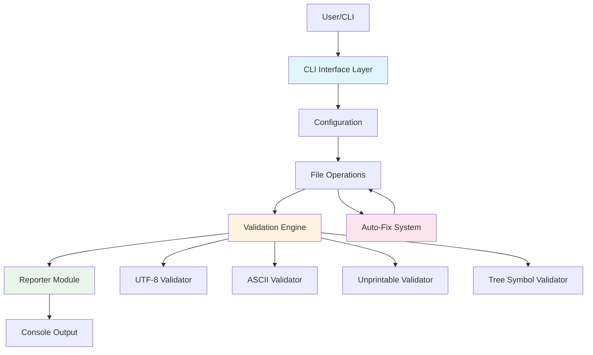
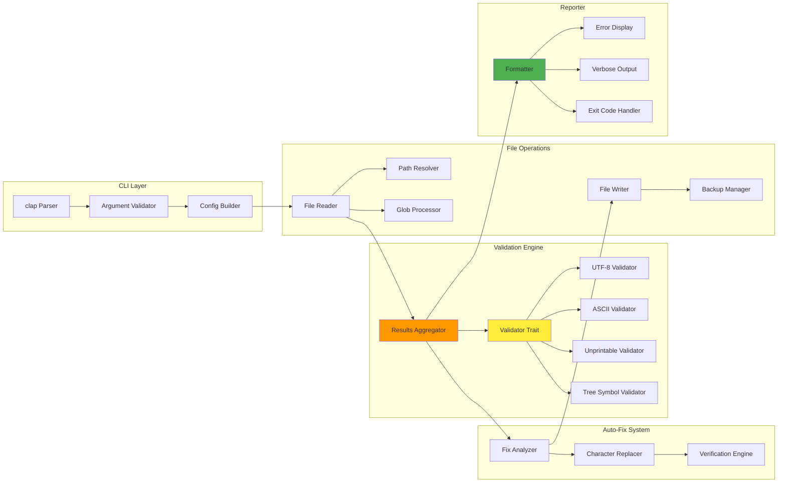
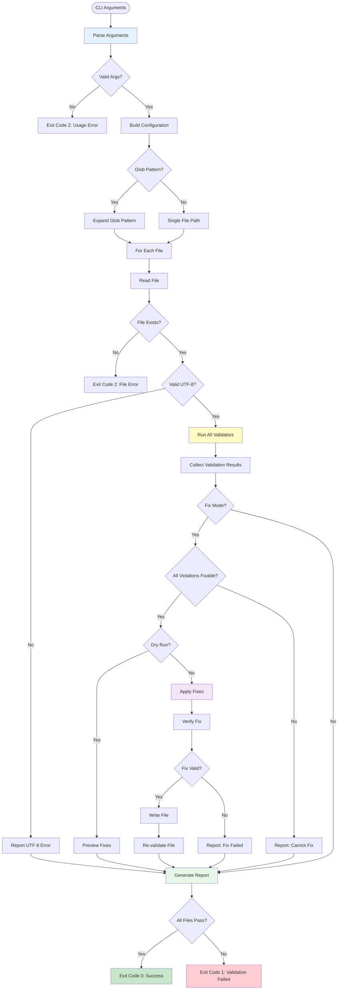
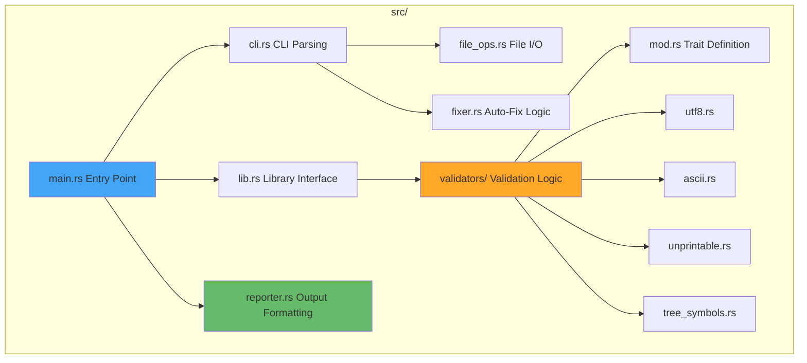
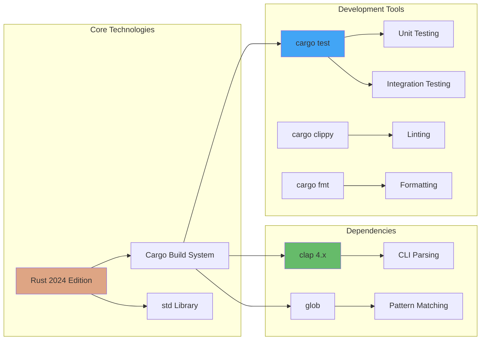
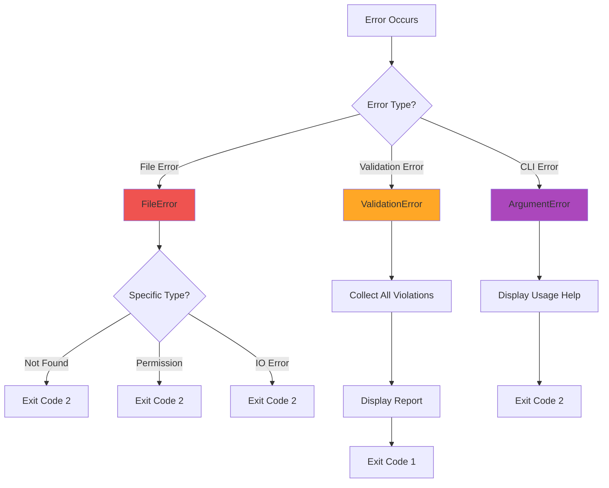

# Architecture Overview

## System Architecture

Markdown Checker follows a layered architecture with clear separation of concerns:



## Component Diagram



## Data Flow Architecture



## Module Structure



## Technology Stack



## Layered Architecture

The system follows a clear layered architecture:

### Layer 1: CLI Interface
- **Responsibility**: Parse user input and validate arguments
- **Technology**: clap crate
- **Output**: Configuration object

### Layer 2: File Operations
- **Responsibility**: Read files, resolve paths, handle glob patterns
- **Technology**: Rust std::fs, glob crate
- **Output**: File contents as strings

### Layer 3: Validation Engine
- **Responsibility**: Run validators, collect results
- **Technology**: Custom validator trait implementation
- **Output**: Validation results with error details

### Layer 4: Auto-Fix System
- **Responsibility**: Analyze fixable violations and apply corrections
- **Technology**: Custom character replacement logic
- **Output**: Fixed file contents

### Layer 5: Reporter
- **Responsibility**: Format output, display errors, set exit codes
- **Technology**: Rust std I/O
- **Output**: Console output and process exit code

## Key Design Patterns

### Strategy Pattern
Each validator implements the `Validator` trait, allowing easy extension and testing:

```rust
pub trait Validator {
    fn name(&self) -> &str;
    fn validate(&self, content: &str) -> ValidationResult;
}
```

### Builder Pattern
Configuration is built from CLI arguments with validation:

```rust
pub struct Config {
    pub path: PathBuf,
    pub filename: String,
    pub verbose: bool,
    pub fix: bool,
    pub dry_run: bool,
}
```

### Chain of Responsibility
Multiple validators process content in sequence, each adding their results to the collection.

## Error Handling Strategy



## Performance Characteristics

- **Single-pass validation**: File content is read once
- **Lazy evaluation**: Validators don't run if earlier errors prevent it
- **Memory efficient**: Line-by-line processing for error reporting
- **Fast glob expansion**: Uses efficient pattern matching
- **Minimal allocations**: Reuses buffers where possible

## Extensibility Points

The architecture supports easy extension:

1. **New Validators**: Implement the `Validator` trait
2. **New Fix Strategies**: Extend the `Fixer` module
3. **New Output Formats**: Add to the `Reporter` module
4. **New File Sources**: Extend `FileOps` module

## Security Considerations

- **Path traversal prevention**: Validates file paths
- **Safe file operations**: Uses Rust's safe file I/O
- **No code execution**: Pure data validation
- **No network access**: Fully offline tool

## Related Documentation

- [Key Components](Components) - Detailed component documentation
- [Workflows & Sequences](Workflows) - Sequence diagrams for operations
- [Validation Engine](Validation-Engine) - Deep dive into validators
- [Testing Strategy](Testing-Strategy) - Testing approach
