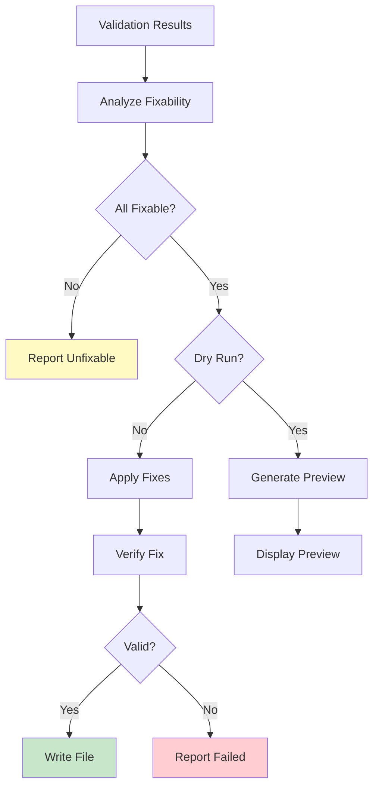
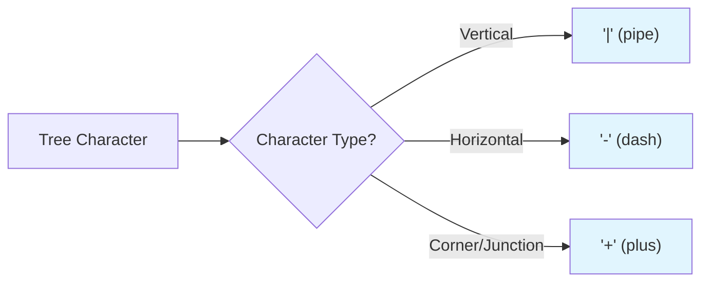
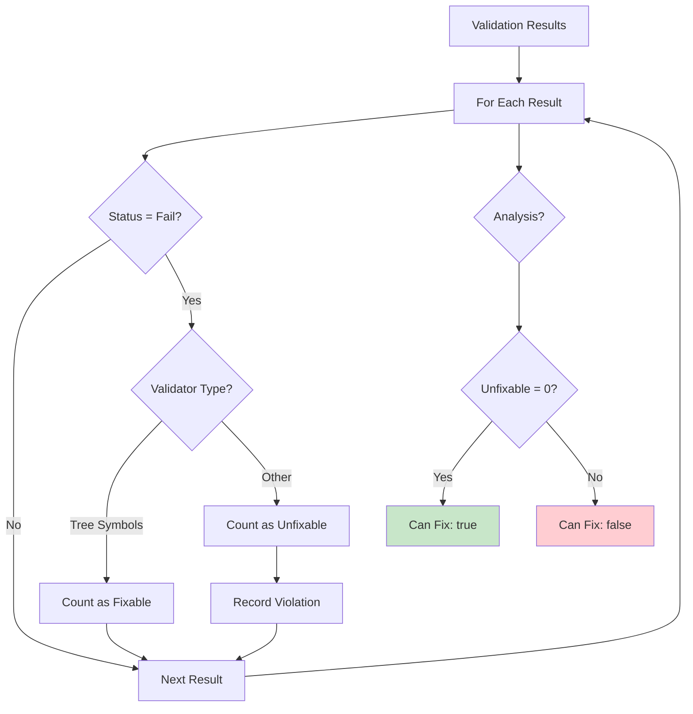
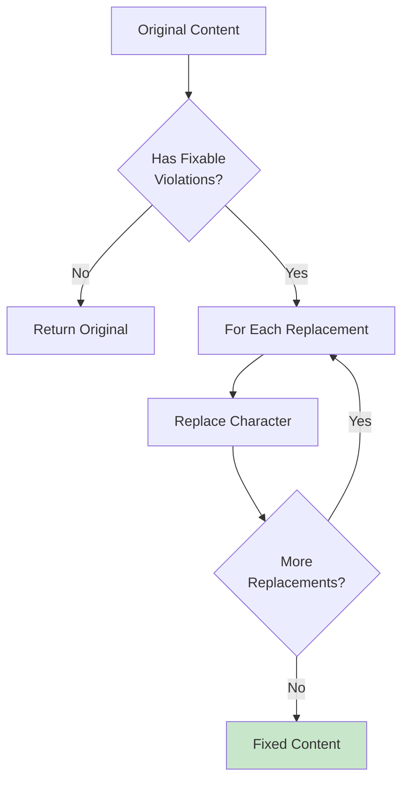
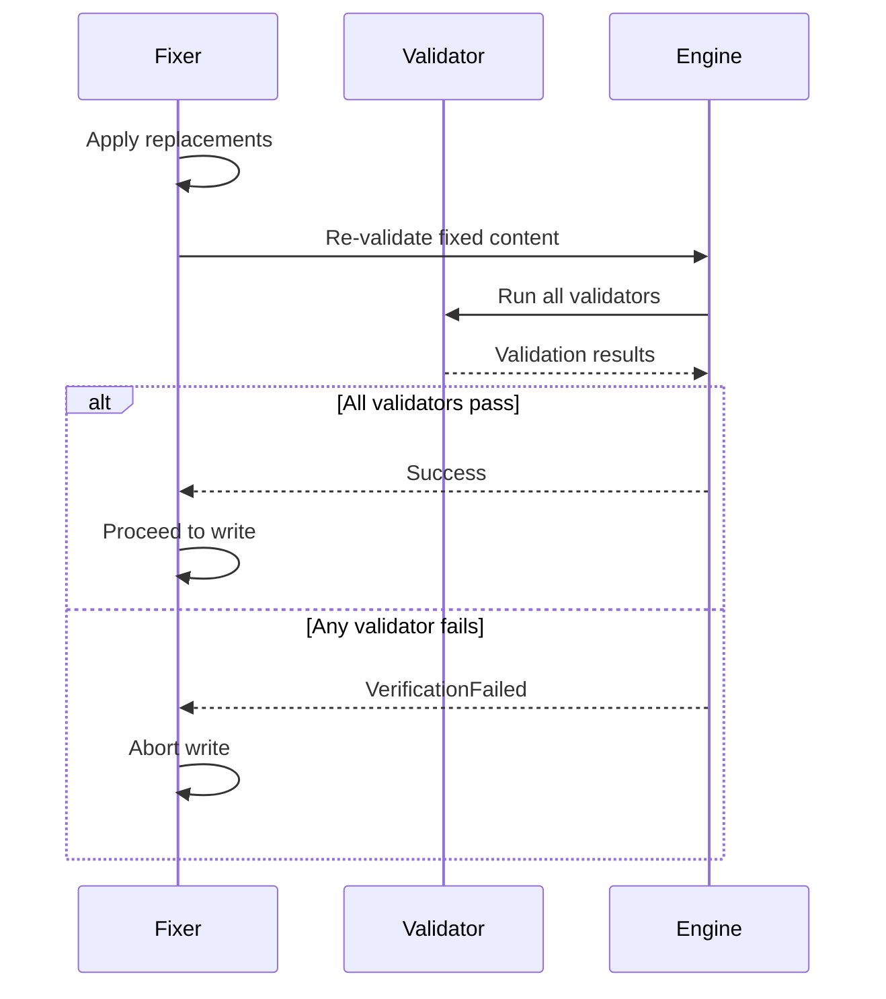
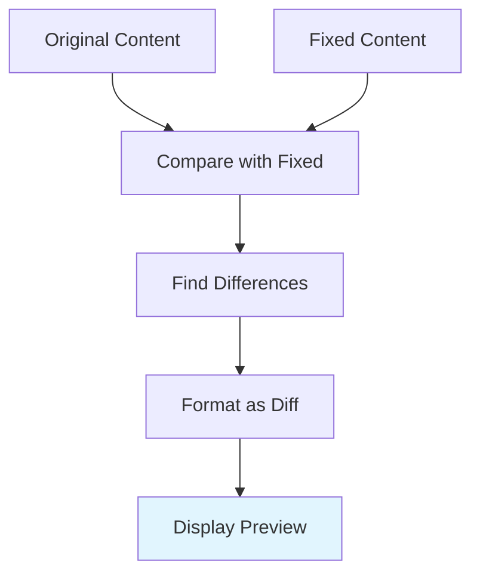
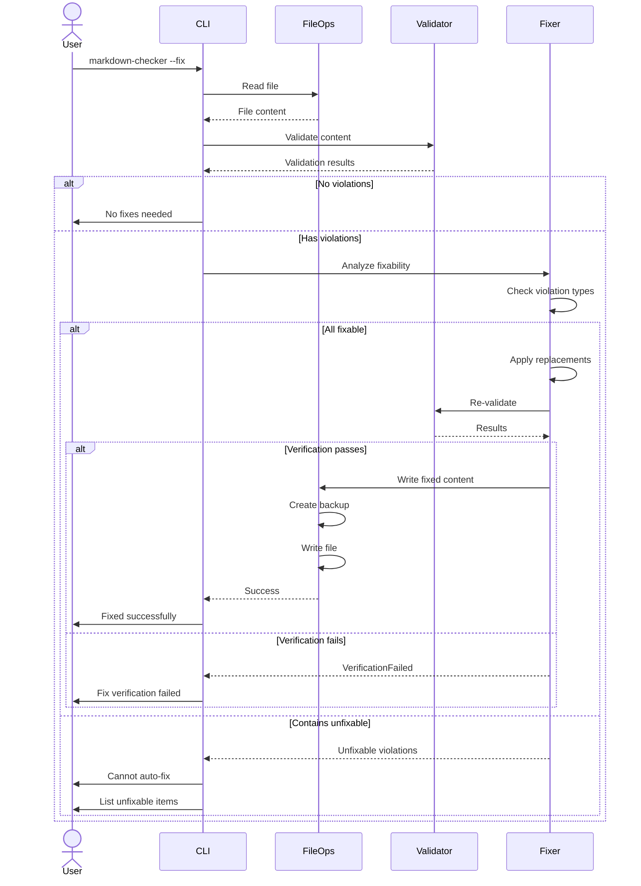
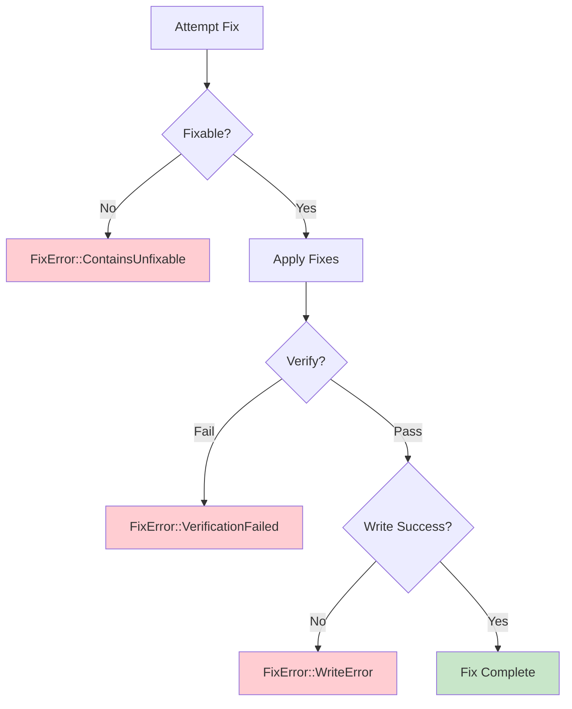

# Auto-Fix System

The Auto-Fix System automatically corrects fixable violations, currently focused on tree symbol replacements.

## Overview



## Module Structure

**Location**: `src/fixer.rs`

**Responsibilities**:
- Analyze validation results for fixability
- Generate character replacement maps
- Apply fixes to content
- Verify fixes work correctly
- Support dry-run preview mode

## Fixable Violations

### Currently Supported

**Tree Symbols** (Box-drawing characters):
```rust
const TREE_REPLACEMENTS: &[(char, char)] = &[
    // Vertical and horizontal
    ('│', '|'),  // U+2502 -> ASCII pipe
    ('─', '-'),  // U+2500 -> ASCII dash

    // Corners and junctions
    ('├', '+'),  // U+251C -> ASCII plus
    ('└', '+'),  // U+2514 -> ASCII plus
    ('┌', '+'),  // U+250C -> ASCII plus
    ('┐', '+'),  // U+2510 -> ASCII plus
    ('┘', '+'),  // U+2518 -> ASCII plus
    ('┤', '+'),  // U+2524 -> ASCII plus
    ('┴', '+'),  // U+2534 -> ASCII plus
    ('┬', '+'),  // U+252C -> ASCII plus
    ('┼', '+'),  // U+253C -> ASCII plus

    // Additional Unicode box-drawing
    ('╭', '+'),  // U+256D
    ('╮', '+'),  // U+256E
    ('╯', '+'),  // U+256F
    ('╰', '+'),  // U+2570
];
```

**Replacement Strategy**:


### Not Currently Fixable

- Emojis (😀, 🎉, etc.)
- Accented characters (é, ñ, ü)
- Mathematical symbols (∑, π, ∞)
- Other Unicode characters
- Invalid UTF-8 sequences
- Control characters

---

## Core Functions

### 1. Analyze Fixability

```rust
pub fn can_fix(results: &[ValidationResult]) -> FixabilityAnalysis {
    let mut fixable_count = 0;
    let mut unfixable_count = 0;
    let mut unfixable_violations = Vec::new();

    for result in results {
        if result.status == ValidationStatus::Fail {
            if result.validator_name == "Tree Symbols" {
                fixable_count += result.errors.len();
            } else {
                unfixable_count += result.errors.len();
                unfixable_violations.extend(result.errors.clone());
            }
        }
    }

    FixabilityAnalysis {
        all_fixable: unfixable_count == 0 && fixable_count > 0,
        fixable_count,
        unfixable_count,
        unfixable_violations,
    }
}
```

**Analysis Flow**:


---

### 2. Apply Fixes

```rust
pub fn apply_fixes(content: &str, results: &[ValidationResult]) -> Result<String, FixError> {
    let analysis = can_fix(results);

    if !analysis.all_fixable {
        return Err(FixError::ContainsUnfixable(analysis.unfixable_violations));
    }

    let mut fixed_content = content.to_string();

    // Apply replacements
    for (from, to) in TREE_REPLACEMENTS {
        fixed_content = fixed_content.replace(*from, &to.to_string());
    }

    Ok(fixed_content)
}
```

**Replacement Algorithm**:


**Example Transformation**:
```
Before:
├── src/
│   ├── main.rs
│   └── lib.rs

After:
+-- src/
|   +-- main.rs
|   +-- lib.rs
```

---

### 3. Verify Fix

```rust
pub fn verify_fix(content: &str) -> Result<(), FixError> {
    let results = validate_all(content);

    if results.iter().any(|r| r.status == ValidationStatus::Fail) {
        return Err(FixError::VerificationFailed(results));
    }

    Ok(())
}
```

**Verification Process**:


**Why Verification is Critical**:
1. Ensures replacements were successful
2. Catches edge cases (e.g., partial Unicode sequences)
3. Confirms no new violations introduced
4. Validates file is now compliant

---

### 4. Dry-Run Mode

```rust
pub fn preview_fixes(content: &str, results: &[ValidationResult]) -> FixPreview {
    let analysis = can_fix(results);

    if !analysis.all_fixable {
        return FixPreview::Unfixable(analysis.unfixable_violations);
    }

    let fixed_content = apply_fixes(content, results).unwrap();
    let changes = generate_diff(content, &fixed_content);

    FixPreview::Success(FixPreviewData {
        original: content.to_string(),
        fixed: fixed_content,
        changes,
        violation_count: analysis.fixable_count,
    })
}
```

**Preview Output Format**:
```
Would fix 3 violations:

  Line 15, Column 5: '├' -> '+'
    Before: ├── src/
    After:  +-- src/

  Line 23, Column 3: '│' -> '|'
    Before: │   ├── main.rs
    After:  |   +-- main.rs

  Line 23, Column 7: '└' -> '+'
    Before: │   └── lib.rs
    After:  |   +-- lib.rs

(File not modified - dry run)
```

**Diff Generation**:


---

## Complete Fix Workflow



---

## Error Handling

### FixError Types

```rust
#[derive(Debug)]
pub enum FixError {
    ContainsUnfixable(Vec<ValidationError>),
    VerificationFailed(Vec<ValidationResult>),
    WriteError(FileError),
}

impl FixError {
    pub fn to_user_message(&self) -> String {
        match self {
            Self::ContainsUnfixable(violations) =>
                format!("Cannot auto-fix: file contains {} unfixable violations", violations.len()),
            Self::VerificationFailed(_) =>
                "Fix verification failed: file still contains violations after fix".to_string(),
            Self::WriteError(e) =>
                format!("Failed to write fixed file: {}", e.to_user_message()),
        }
    }
}
```

**Error Flow**:


---

## Safety Features

### 1. Backup Before Modification

```rust
pub fn fix_file_safe(path: &Path) -> Result<(), FixError> {
    // Read original
    let content = read_file(path)?;

    // Validate
    let results = validate_all(&content);

    // Check fixability
    let analysis = can_fix(&results);
    if !analysis.all_fixable {
        return Err(FixError::ContainsUnfixable(analysis.unfixable_violations));
    }

    // Create backup BEFORE modifying
    create_backup(path)?;

    // Apply fixes
    let fixed = apply_fixes(&content, &results)?;

    // Verify
    verify_fix(&fixed)?;

    // Write
    write_file(path, &fixed)?;

    Ok(())
}
```

### 2. Atomic Operations

```rust
pub fn fix_file_atomic(path: &Path) -> Result<(), FixError> {
    let temp_path = path.with_extension("tmp");

    // Write to temporary file first
    write_file(&temp_path, &fixed_content)?;

    // Verify temporary file
    let temp_content = read_file(&temp_path)?;
    verify_fix(&temp_content)?;

    // Atomic rename (replaces original)
    fs::rename(&temp_path, path)?;

    Ok(())
}
```

### 3. Rollback on Failure

```rust
pub fn fix_file_with_rollback(path: &Path) -> Result<(), FixError> {
    let backup_path = create_backup(path)?;

    match fix_file_safe(path) {
        Ok(()) => {
            // Success - can delete backup
            fs::remove_file(backup_path).ok();
            Ok(())
        }
        Err(e) => {
            // Failure - restore from backup
            fs::copy(&backup_path, path)?;
            fs::remove_file(backup_path).ok();
            Err(e)
        }
    }
}
```

---

## Future Enhancements

### 1. Configurable Replacements

```rust
// Future: Load from config file
pub struct FixConfig {
    pub replacements: HashMap<char, char>,
    pub enabled_fixers: Vec<String>,
}

// .markdown-checker.toml
[fix]
tree_symbols = true
smart_quotes = false

[replacements]
"├" = "+"
"│" = "|"
```

### 2. Additional Fixers

**Smart Quotes**:
```rust
const QUOTE_REPLACEMENTS: &[(char, char)] = &[
    ('"', '"'),  // U+201C -> ASCII quote
    ('"', '"'),  // U+201D -> ASCII quote
    (''', '\''), // U+2018 -> ASCII apostrophe
    (''', '\''), // U+2019 -> ASCII apostrophe
];
```

**Dashes**:
```rust
const DASH_REPLACEMENTS: &[(char, &str)] = &[
    ('—', '--'),  // em dash
    ('–', '-'),   // en dash
];
```

### 3. Interactive Fix Mode

```rust
pub fn fix_interactive(path: &Path) -> Result<(), FixError> {
    for violation in violations {
        println!("Fix this violation? (y/n)");
        println!("  {}", violation.message);

        if user_confirms() {
            apply_single_fix(violation)?;
        }
    }
}
```

---

## Testing Fix System

### Unit Test Examples

```rust
#[cfg(test)]
mod tests {
    use super::*;

    #[test]
    fn test_tree_symbol_replacement() {
        let content = "├── src/\n│   └── main.rs";
        let results = validate_all(content);
        let fixed = apply_fixes(content, &results).unwrap();

        assert_eq!(fixed, "+-- src/\n|   +-- main.rs");
    }

    #[test]
    fn test_unfixable_content() {
        let content = "Hello 😀";
        let results = validate_all(content);
        let result = apply_fixes(content, &results);

        assert!(matches!(result, Err(FixError::ContainsUnfixable(_))));
    }

    #[test]
    fn test_fix_verification() {
        let content = "├── src/";
        let results = validate_all(content);
        let fixed = apply_fixes(content, &results).unwrap();

        assert!(verify_fix(&fixed).is_ok());
    }
}
```

---

## Related Documentation

- [Components Overview](Components.md)
- [Validation Engine](Validation-Engine.md)
- [File Operations](File-Operations.md)
- [Workflows & Sequences](Workflows.md)
