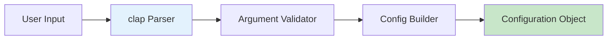
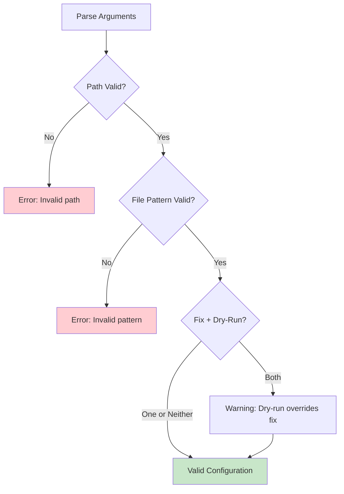
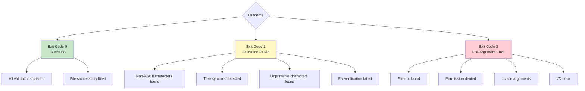

# CLI Interface

The CLI (Command-Line Interface) component is responsible for parsing user input and converting it into a structured configuration object.

## Overview



## Implementation (cli.rs)

### Argument Structure

```rust
use clap::Parser;

#[derive(Parser, Debug)]
#[command(name = "markdown-checker")]
#[command(author = "Michael A Wright")]
#[command(version)]
#[command(about = "Validates markdown files for UTF-8, ASCII-subset, and unprintable characters")]
pub struct Cli {
    /// Path to directory containing the file
    #[arg(short, long, value_name = "PATH", default_value = ".")]
    pub path: PathBuf,

    /// Name of the file to check or glob pattern
    #[arg(short = 'f', long, value_name = "NAME", default_value = "README.md")]
    pub file_name: String,

    /// Enable verbose output
    #[arg(short, long)]
    pub verbose: bool,

    /// Automatically fix violations where possible (tree symbols only)
    #[arg(long)]
    pub fix: bool,

    /// Preview fixes without applying them (dry-run mode)
    #[arg(short = 'n', long)]
    pub dry_run: bool,
}
```

## Command-Line Options

### Path Option (-p, --path)

**Purpose**: Specify the directory containing the file to check

**Default**: Current directory (`.`)

**Examples**:
```bash
markdown-checker -p docs
markdown-checker --path /home/user/projects/myapp
```

**Behavior**:
- Accepts absolute or relative paths
- Resolves relative paths from current working directory
- Validates directory existence

---

### Filename Option (-f, --file-name)

**Purpose**: Specify the file to check or a glob pattern

**Default**: `README.md`

**Examples**:
```bash
# Single file
markdown-checker -f CONTRIBUTING.md

# Glob pattern
markdown-checker -f "*.md"
markdown-checker -f "docs/**/*.md"
```

**Behavior**:
- Supports exact filenames
- Supports glob patterns with wildcards
- Must be quoted when using special characters

---

### Verbose Flag (-v, --verbose)

**Purpose**: Enable detailed progress output

**Default**: `false`

**Example**:
```bash
markdown-checker -v
```

**Output Difference**:

**Normal Mode**:
```
✓ File validation successful: ./README.md
```

**Verbose Mode**:
```
Checking file: ./README.md
File size: 1,234 bytes

Running validators...
[1/4] UTF-8 Encoding... ✓ Pass
[2/4] ASCII Subset... ✓ Pass
[3/4] Printable Characters... ✓ Pass
[4/4] Tree Symbols... ✓ Pass

✓ File validation successful: ./README.md
```

---

### Fix Flag (--fix)

**Purpose**: Automatically fix violations where possible

**Default**: `false`

**Example**:
```bash
markdown-checker --fix
```

**Behavior**:
- Only fixes tree symbol violations
- Fails if file contains other types of violations
- Verifies fix before writing
- Creates backup before modification

**Safety Checks**:
1. Verify all violations are fixable
2. Apply replacements
3. Re-validate fixed content
4. Only write if validation passes

---

### Dry-Run Flag (-n, --dry-run)

**Purpose**: Preview fixes without applying them

**Default**: `false`

**Example**:
```bash
markdown-checker --dry-run
markdown-checker -n
```

**Output**:
```
Would fix 3 violations:
  Line 15, Column 5: '├' -> '+'
  Line 23, Column 3: '│' -> '|'
  Line 23, Column 7: '└' -> '+'

(File not modified - dry run)
```

---

## Argument Validation



### Validation Rules

1. **Path Validation**:
   - Must be a valid directory path
   - Directory must exist (checked at runtime)

2. **Filename Validation**:
   - Cannot be empty
   - Glob patterns must be properly quoted

3. **Flag Compatibility**:
   - `--dry-run` implies preview mode
   - `--fix` without `--dry-run` applies changes
   - Both flags together: dry-run takes precedence

## Configuration Building

```rust
impl Cli {
    pub fn build_config(&self) -> Config {
        Config {
            path: self.path.clone(),
            filename: self.file_name.clone(),
            verbose: self.verbose,
            fix: self.fix && !self.dry_run, // dry-run overrides fix
            dry_run: self.dry_run,
        }
    }
}
```

## Help Output

### Short Help (-h)

```
Usage: markdown-checker [OPTIONS]

Options:
  -p, --path <PATH>          Path to directory [default: .]
  -f, --file-name <NAME>     File to check or glob pattern [default: README.md]
  -v, --verbose              Enable verbose output
      --fix                  Automatically fix violations (tree symbols only)
  -n, --dry-run              Preview fixes without applying them
  -h, --help                 Print help
  -V, --version              Print version
```

### Extended Help (--help)

Includes detailed examples and safety information about the `--fix` flag.

## Version Output

```bash
markdown-checker --version
```

```
markdown-checker 0.1.1
Copyright (c) 2025 Michael A Wright
Licensed under MIT License
```

## Usage Examples

### Example 1: Basic Validation

```bash
markdown-checker
```
Checks `./README.md` with default settings.

---

### Example 2: Custom File and Path

```bash
markdown-checker -p docs/api -f overview.md -v
```
Checks `docs/api/overview.md` with verbose output.

---

### Example 3: Glob Pattern Processing

```bash
markdown-checker -f "docs/**/*.md"
```
Checks all markdown files recursively in the `docs` directory.

---

### Example 4: Auto-Fix with Preview

```bash
# Preview changes
markdown-checker --dry-run

# Apply changes
markdown-checker --fix
```

---

### Example 5: CI/CD Integration

```bash
#!/bin/bash
if markdown-checker -f "*.md"; then
    echo "All markdown files validated successfully"
else
    echo "Markdown validation failed"
    exit 1
fi
```

## Error Handling

### Invalid Path

```bash
markdown-checker -p /nonexistent
```
```
Error: Directory not found: /nonexistent
Exit code: 2
```

---

### Invalid Glob Pattern

```bash
markdown-checker -f "[invalid"
```
```
Error: Invalid glob pattern: [invalid
Exit code: 2
```

---

### File Not Found

```bash
markdown-checker -f nonexistent.md
```
```
Error: File not found: ./nonexistent.md
Exit code: 2
```

## Exit Codes



## Integration with clap

The CLI uses the `clap` crate's derive API for clean, declarative argument parsing:

**Benefits**:
- Automatic help generation
- Type-safe argument parsing
- Built-in validation
- Comprehensive error messages
- Shell completion support (future)

**Version**: clap 4.x with derive feature

## Related Documentation

- [Components Overview](Components.md)
- [Workflows & Sequences](Workflows.md)
- [File Operations](File-Operations.md)
