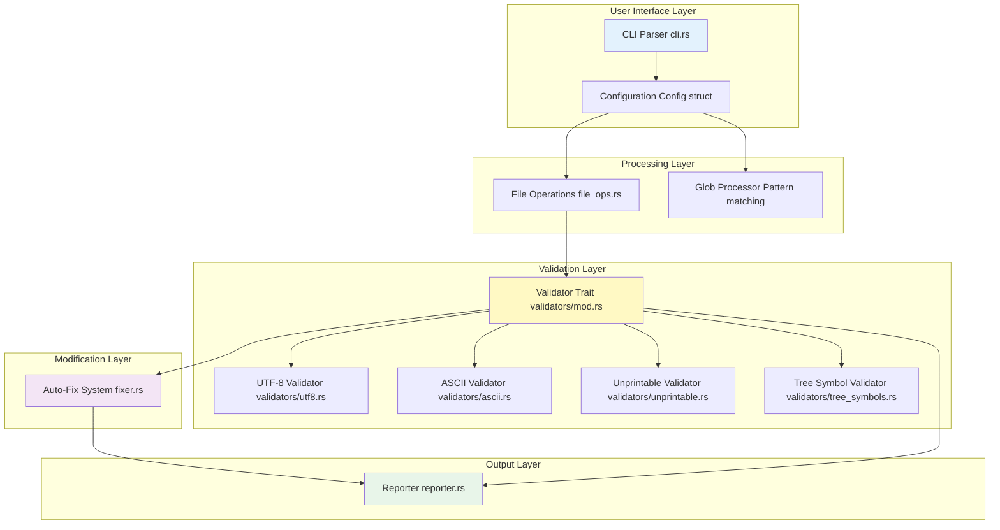
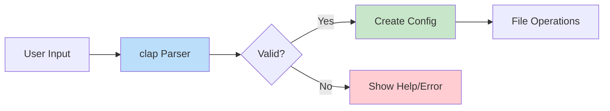
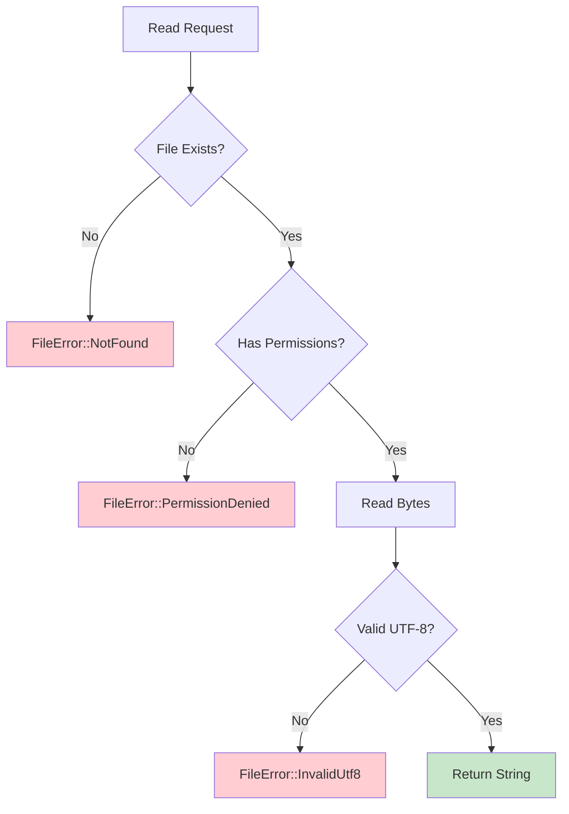
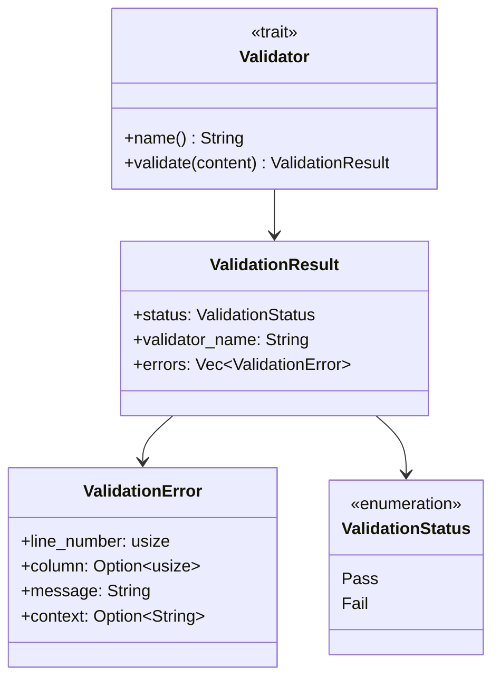
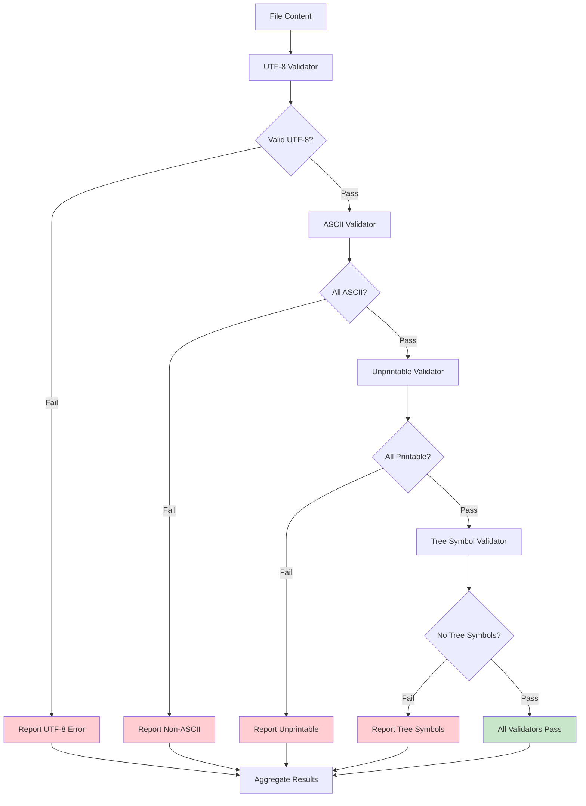
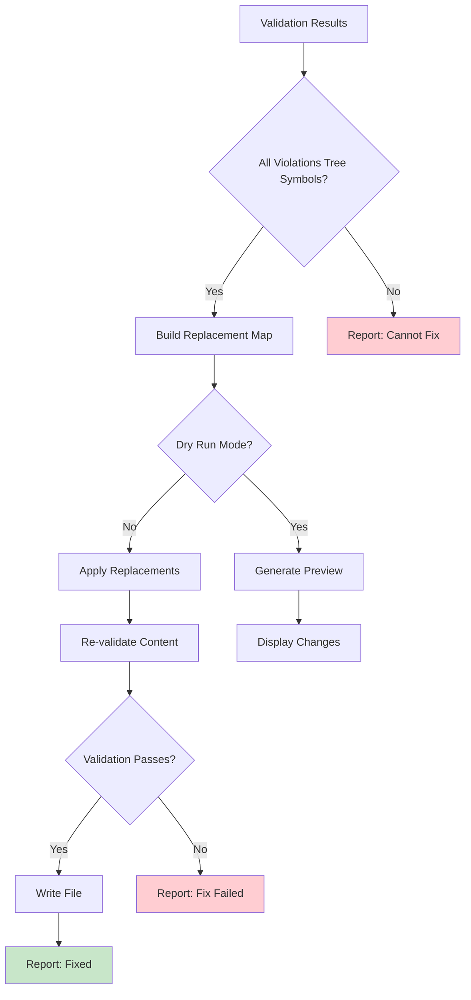
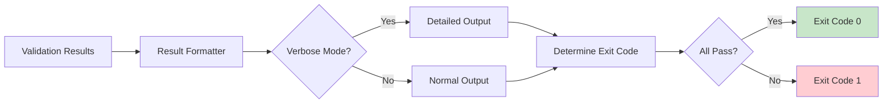
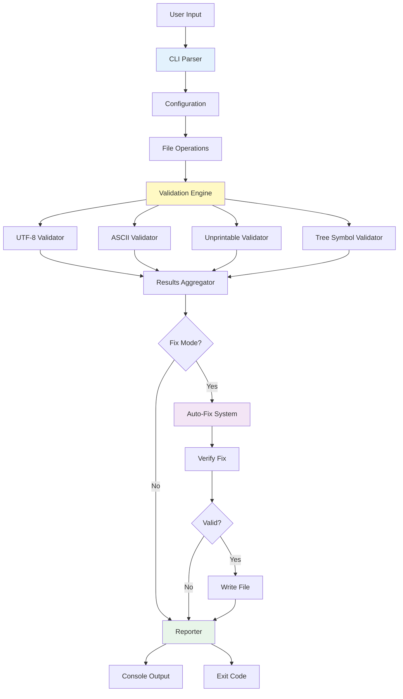

# Key Components

This page provides a detailed overview of the major components in the Markdown Checker system.

## Component Overview Diagram



---

## Component Details

### 1. CLI Parser (cli.rs)

**Responsibility**: Parse and validate command-line arguments

**Key Features**:
- Built on `clap` crate for robust argument parsing
- Provides help text and version information
- Validates argument combinations
- Supports multiple flags and options

**Arguments**:
- `-p, --path <PATH>` - Directory path (default: current directory)
- `-f, --file-name <NAME>` - Filename or glob pattern (default: README.md)
- `-v, --verbose` - Enable verbose output
- `--fix` - Auto-fix violations
- `-n, --dry-run` - Preview fixes without applying

**Data Structures**:
```rust
pub struct Cli {
    pub path: PathBuf,
    pub file_name: String,
    pub verbose: bool,
    pub fix: bool,
    pub dry_run: bool,
}
```

**Diagram**:


---

### 2. Configuration (Config struct)

**Responsibility**: Store validated runtime configuration

**Key Features**:
- Immutable after creation
- Provides helper methods for path construction
- Centralized configuration access

**Data Structure**:
```rust
pub struct Config {
    pub path: PathBuf,
    pub filename: String,
    pub verbose: bool,
    pub fix: bool,
    pub dry_run: bool,
}

impl Config {
    pub fn file_path(&self) -> PathBuf {
        self.path.join(&self.filename)
    }
}
```

---

### 3. File Operations (file_ops.rs)

**Responsibility**: Handle all file I/O operations

**Key Features**:
- Safe file reading with error handling
- UTF-8 validation during read
- Glob pattern expansion
- File writing for auto-fix
- Backup creation before modifications

**Functions**:
- `read_file(path: &Path) -> Result<String, FileError>`
- `write_file(path: &Path, content: &str) -> Result<(), FileError>`
- `expand_glob(pattern: &str) -> Result<Vec<PathBuf>, GlobError>`

**Error Types**:
```rust
pub enum FileError {
    NotFound(PathBuf),
    PermissionDenied(PathBuf),
    InvalidUtf8(PathBuf),
    IoError(PathBuf, std::io::Error),
}
```

**Diagram**:


---

### 4. Validator Trait (validators/mod.rs)

**Responsibility**: Define interface for all validators

**Key Features**:
- Common interface for all validation logic
- Extensible design for new validators
- Standardized result format

**Trait Definition**:
```rust
pub trait Validator {
    fn name(&self) -> &str;
    fn validate(&self, content: &str) -> ValidationResult;
}
```

**Result Structures**:
```rust
pub struct ValidationResult {
    pub status: ValidationStatus,
    pub validator_name: String,
    pub errors: Vec<ValidationError>,
}

pub struct ValidationError {
    pub line_number: usize,
    pub column: Option<usize>,
    pub message: String,
    pub context: Option<String>,
}

pub enum ValidationStatus {
    Pass,
    Fail,
}
```

**Diagram**:


---

### 5. Validators

#### UTF-8 Validator (validators/utf8.rs)

**Purpose**: Ensure file is valid UTF-8 encoded text

**Implementation Note**: UTF-8 validation occurs during file reading when converting bytes to string. This validator confirms the string is valid.

#### ASCII Validator (validators/ascii.rs)

**Purpose**: Detect any characters outside ASCII range (0-127)

**Algorithm**:
1. Iterate through each line
2. For each character, check if code point > 127
3. Record violations with line and column numbers
4. Provide Unicode code point in error message

**Example Violations**:
- Emojis (U+1F600, etc.)
- Accented characters (é, ñ, ü)
- Box-drawing symbols (├, │, ─)
- Mathematical symbols (∑, π, ∞)

#### Unprintable Validator (validators/unprintable.rs)

**Purpose**: Detect control characters and unprintable bytes

**Allowed Characters**:
- Printable ASCII: 32-126 (space through tilde)
- Whitespace: space (32), tab (9), newline (10), carriage return (13)

**Disallowed Characters**:
- Null bytes (0)
- Bell character (7)
- Other control characters
- Delete character (127)

**Algorithm**:
```rust
fn is_printable(ch: char) -> bool {
    let code = ch as u32;
    (code >= 32 && code <= 126) || is_allowed_whitespace(ch)
}
```

#### Tree Symbol Validator (validators/tree_symbols.rs)

**Purpose**: Detect box-drawing characters used in directory trees

**Detected Symbols**:
- Box Drawing Unicode Block: U+2500 - U+257F
- Common symbols: ├ └ │ ─ ┌ ┐ ┘ ┤ ┴ ┬ ┼

**Suggestions**:
```rust
match symbol {
    '├' | '┤' => "Use '+' or '|' instead",
    '└' | '┘' | '┌' | '┐' => "Use '+' or '`' instead",
    '│' => "Use '|' instead",
    '─' => "Use '-' instead",
    _ => "Use standard ASCII characters",
}
```

**Diagram**:


---

### 6. Auto-Fix System (fixer.rs)

**Responsibility**: Automatically correct fixable violations

**Key Features**:
- Analyzes validation results for fixability
- Currently supports tree symbol replacement
- Verifies fixes before writing
- Supports dry-run mode for preview

**Fixable Violations**:
- Tree symbols (box-drawing characters)

**Unfixable Violations**:
- Other Unicode characters (emojis, accents)
- Invalid UTF-8 sequences
- Control characters

**Replacement Map**:
```rust
const TREE_REPLACEMENTS: &[(char, char)] = &[
    ('├', '+'),
    ('└', '+'),
    ('│', '|'),
    ('─', '-'),
    ('┌', '+'),
    ('┐', '+'),
    ('┘', '+'),
    ('┤', '+'),
    // ... more mappings
];
```

**Fix Process**:


---

### 7. Reporter (reporter.rs)

**Responsibility**: Format and display validation results

**Key Features**:
- Normal and verbose output modes
- Color-coded output (pass/fail indicators)
- Detailed error messages with line numbers
- Exit code management

**Output Modes**:

**Normal Mode**:
```
✓ File validation successful: ./README.md
```

**Failure Output**:
```
✗ File validation failed: ./README.md

ASCII Subset: ✗ Fail (2 errors)
  Line 15, Column 5: Non-ASCII character: '├' (U+251C)
  Line 23, Column 3: Non-ASCII character: '│' (U+2502)

Tree Symbols: ✗ Fail (2 errors)
  Line 15, Column 5: Tree symbol '├' (U+251C) detected. Use '+' or '|' instead
  Line 23, Column 3: Tree symbol '│' (U+2502) detected. Use '|' instead
```

**Verbose Mode**:
```
Checking file: ./README.md
File size: 1,234 bytes

Running validators...
[1/4] UTF-8 Encoding... ✓ Pass
[2/4] ASCII Subset... ✗ Fail (2 errors found)
[3/4] Printable Characters... ✓ Pass
[4/4] Tree Symbols... ✗ Fail (2 errors found)

Results:
[Detailed output as above]
```

**Exit Codes**:
- `0` - All validations passed
- `1` - Validation failures detected
- `2` - File errors or invalid arguments

**Diagram**:


---

## Component Interaction Summary



---

## Related Documentation

- [Architecture Overview](Architecture) - High-level system architecture
- [Workflows & Sequences](Workflows) - Detailed sequence diagrams
- [CLI Interface](CLI-Interface) - CLI component deep dive
- [Validation Engine](Validation-Engine) - Validator implementation details
- [Auto-Fix System](Auto-Fix-System) - Fix mechanism deep dive
- [Reporter Module](Reporter-Module) - Output formatting details
