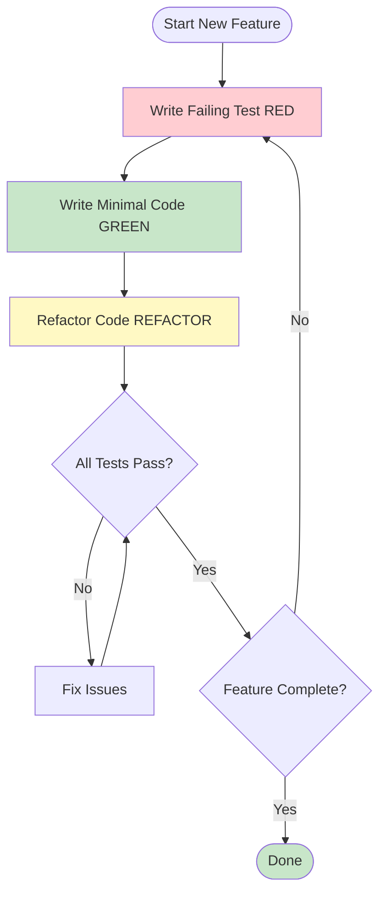
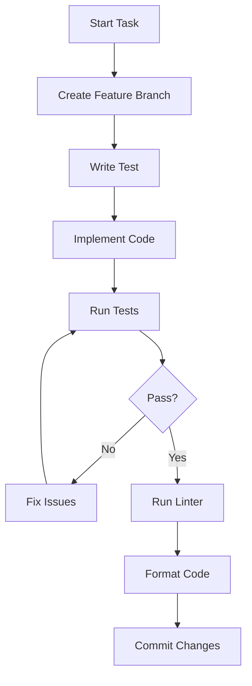
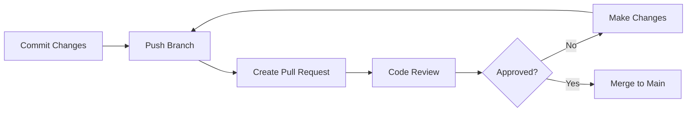
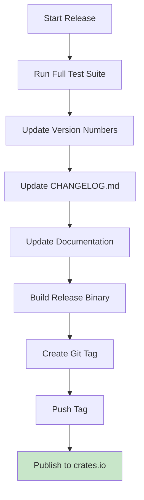

# Development Process

Markdown Checker follows Test-Driven Development (TDD) methodology with a focus on code quality and maintainability.

## TDD Workflow



## Development Cycle

### Phase 1: RED - Write Failing Test

**Goal**: Define expected behavior through tests

**Process**:
1. Understand the requirement
2. Write a test that defines the expected behavior
3. Run the test and verify it fails
4. Ensure it fails for the right reason

**Example**:
```rust
#[test]
fn test_ascii_validator_detects_unicode() {
    let validator = AsciiValidator;
    let content = "Text with unicode: ├";

    let result = validator.validate(content);

    assert_eq!(result.status, ValidationStatus::Fail);
    assert_eq!(result.errors.len(), 1);
}
```

**Run Test**:
```bash
cargo test test_ascii_validator_detects_unicode
```

**Expected**: Test fails (code not implemented yet)

---

### Phase 2: GREEN - Write Minimal Code

**Goal**: Make the test pass with the simplest implementation

**Process**:
1. Write just enough code to make the test pass
2. Don't worry about optimization yet
3. Focus on correctness
4. Run tests frequently

**Example**:
```rust
impl Validator for AsciiValidator {
    fn validate(&self, content: &str) -> ValidationResult {
        let mut errors = Vec::new();

        for (line_num, line) in content.lines().enumerate() {
            for (col, ch) in line.chars().enumerate() {
                if ch as u32 > 127 {
                    errors.push(ValidationError {
                        line_number: line_num + 1,
                        column: Some(col + 1),
                        message: format!("Non-ASCII character: '{}'", ch),
                        context: Some(line.to_string()),
                    });
                }
            }
        }

        ValidationResult {
            status: if errors.is_empty() {
                ValidationStatus::Pass
            } else {
                ValidationStatus::Fail
            },
            validator_name: self.name().to_string(),
            errors,
        }
    }
}
```

**Run Test**:
```bash
cargo test test_ascii_validator_detects_unicode
```

**Expected**: Test passes

---

### Phase 3: REFACTOR - Improve Code

**Goal**: Clean up code while maintaining passing tests

**Process**:
1. Identify code smells
2. Extract common patterns
3. Improve naming
4. Optimize if needed
5. Run tests after each change

**Example Refactorings**:

**Before**:
```rust
if ch as u32 > 127 {
    errors.push(ValidationError {
        line_number: line_num + 1,
        column: Some(col + 1),
        message: format!("Non-ASCII character: '{}'", ch),
        context: Some(line.to_string()),
    });
}
```

**After** (extracted helper):
```rust
fn create_ascii_error(ch: char, line_num: usize, col: usize, line: &str) -> ValidationError {
    ValidationError {
        line_number: line_num + 1,
        column: Some(col + 1),
        message: format!("Non-ASCII character: '{}' (U+{:04X})", ch, ch as u32),
        context: Some(line.to_string()),
    }
}
```

---

## Development Workflow

### 1. Planning Phase


**Activities**:
- Review requirements
- Identify affected components
- Design API/interfaces
- Break down into small tasks
- Document in `docs/plan.md`

---

### 2. Implementation Phase



**Activities**:
1. Create feature branch
2. Write failing tests
3. Implement feature
4. Run tests
5. Run linter (clippy)
6. Format code
7. Commit changes

---

### 3. Review Phase



**Activities**:
- Push feature branch
- Create pull request
- Code review
- Address feedback
- Merge to main

---

## Git Workflow

### Branch Strategy

**Main Branch**:
- `main` - Production-ready code
- Always passes all tests
- Tagged with version numbers

**Feature Branches**:
- `feature/validator-improvements`
- `fix/tree-symbol-detection`
- `docs/update-readme`

**Branch Naming**:
```
<type>/<description>

Types:
- feature/ - New features
- fix/     - Bug fixes
- docs/    - Documentation
- test/    - Test improvements
- refactor/- Code refactoring
```

---

### Commit Messages

**Format**:
```
<type>: <subject>

<body>

<footer>
```

**Example**:
```
feat: Add auto-fix functionality for tree symbols

Implements automatic replacement of Unicode box-drawing characters
with ASCII alternatives. Includes dry-run mode for previewing
changes before applying them.

Closes #123
```

**Types**:
- `feat`: New feature
- `fix`: Bug fix
- `docs`: Documentation changes
- `test`: Test additions/changes
- `refactor`: Code refactoring
- `style`: Formatting changes
- `chore`: Build/tooling changes

---

## Code Quality Standards

### 1. Run Tests

```bash
# All tests
cargo test

# With output
cargo test -- --nocapture

# Specific test
cargo test test_name
```

**Requirement**: All tests must pass before committing

---

### 2. Run Linter

```bash
cargo clippy -- -D warnings
```

**Requirement**: No clippy warnings allowed

**Common Issues**:
```rust
// Bad - unnecessary clone
let x = value.clone();

// Good
let x = value;

// Bad - unnecessary mut
let mut x = 5;

// Good
let x = 5;
```

---

### 3. Format Code

```bash
cargo fmt
```

**Requirement**: All code must be formatted

**Configuration** (`rustfmt.toml`):
```toml
edition = "2024"
max_width = 100
tab_spaces = 4
```

---

### 4. Check Documentation

```bash
cargo doc --no-deps --open
```

**Requirement**: Public APIs must be documented

**Example**:
```rust
/// Validates that all characters are within ASCII range (0-127).
///
/// # Arguments
///
/// * `content` - The text content to validate
///
/// # Returns
///
/// A `ValidationResult` containing any violations found
pub fn validate(&self, content: &str) -> ValidationResult {
    // Implementation
}
```

---

## Code Style Guidelines

### 1. Naming Conventions

**Structs and Enums** (PascalCase):
```rust
struct AsciiValidator;
enum ValidationStatus;
```

**Functions and Variables** (snake_case):
```rust
fn validate_content() { }
let error_count = 0;
```

**Constants** (SCREAMING_SNAKE_CASE):
```rust
const MAX_LINE_LENGTH: usize = 100;
```

---

### 2. Error Handling

**Use Result for recoverable errors**:
```rust
pub fn read_file(path: &Path) -> Result<String, FileError> {
    // Implementation
}
```

**Use custom error types**:
```rust
#[derive(Debug)]
pub enum FileError {
    NotFound(PathBuf),
    PermissionDenied(PathBuf),
    IoError(PathBuf, std::io::Error),
}
```

---

### 3. Documentation

**Module Documentation**:
```rust
//! File operations module
//!
//! Handles all file I/O including reading, writing, and glob expansion.
```

**Function Documentation**:
```rust
/// Reads a file and returns its contents as a string.
///
/// # Arguments
///
/// * `path` - Path to the file to read
///
/// # Errors
///
/// Returns `FileError` if:
/// - File doesn't exist (`FileError::NotFound`)
/// - Insufficient permissions (`FileError::PermissionDenied`)
/// - File is not valid UTF-8 (`FileError::InvalidUtf8`)
pub fn read_file(path: &Path) -> Result<String, FileError>
```

---

## Release Process

### Version Numbering

**Semantic Versioning**: `MAJOR.MINOR.PATCH`

- **MAJOR**: Breaking API changes
- **MINOR**: New features (backward compatible)
- **PATCH**: Bug fixes (backward compatible)

**Examples**:
- `0.1.0` - Initial release
- `0.1.1` - Bug fix
- `0.2.0` - New feature (auto-fix)
- `1.0.0` - Stable API

---

### Release Checklist



**Steps**:

1. **Run Tests**:
   ```bash
   cargo test
   cargo clippy
   cargo fmt -- --check
   ```

2. **Update Version**:
   ```toml
   # Cargo.toml
   [package]
   version = "0.2.0"
   ```

3. **Update CHANGELOG**:
   ```markdown
   ## [0.2.0] - 2025-01-15

   ### Added
   - Auto-fix functionality for tree symbols
   - Dry-run mode for previewing fixes

   ### Changed
   - Improved error messages

   ### Fixed
   - Column number reporting
   ```

4. **Build Release**:
   ```bash
   cargo build --release
   ```

5. **Create Tag**:
   ```bash
   git tag -a v0.2.0 -m "Release version 0.2.0"
   git push origin v0.2.0
   ```

6. **Publish** (future):
   ```bash
   cargo publish
   ```

---

## Project Structure

### Directory Organization

```
markdown-checker/
├── src/                    # Source code
│   ├── main.rs            # Entry point
│   ├── lib.rs             # Library exports
│   ├── cli.rs             # CLI parsing
│   ├── file_ops.rs        # File operations
│   ├── fixer.rs           # Auto-fix logic
│   ├── reporter.rs        # Output formatting
│   └── validators/        # Validation logic
│       ├── mod.rs
│       ├── ascii.rs
│       ├── unprintable.rs
│       └── tree_symbols.rs
├── tests/                 # Test files
│   ├── fixtures/          # Test data
│   ├── unit/              # Unit tests
│   └── integration/       # Integration tests
├── docs/                  # Documentation
│   ├── architecture.md
│   ├── design.md
│   ├── prd.md
│   └── process.md
├── wiki/                  # GitHub Wiki (this documentation)
├── Cargo.toml            # Package manifest
├── Cargo.lock            # Dependency lock file
├── README.md             # Project readme
└── LICENSE               # License file
```

---

## Development Tools

### Essential Tools

1. **Rust Toolchain**:
   ```bash
   rustup install stable
   rustup default stable
   ```

2. **Clippy** (Linter):
   ```bash
   rustup component add clippy
   ```

3. **Rustfmt** (Formatter):
   ```bash
   rustup component add rustfmt
   ```

4. **Cargo Watch** (Auto-rebuild):
   ```bash
   cargo install cargo-watch
   cargo watch -x test
   ```

5. **Tarpaulin** (Coverage):
   ```bash
   cargo install cargo-tarpaulin
   ```

---

### IDE Setup

**VS Code Extensions**:
- rust-analyzer
- CodeLLDB (debugging)
- Better TOML
- Error Lens

**IntelliJ IDEA**:
- Rust plugin

---

## Common Development Tasks

### Add New Validator

1. **Create validator file**:
   ```bash
   touch src/validators/my_validator.rs
   ```

2. **Implement Validator trait**:
   ```rust
   pub struct MyValidator;

   impl Validator for MyValidator {
       fn name(&self) -> &str {
           "My Validation Rule"
       }

       fn validate(&self, content: &str) -> ValidationResult {
           // Implementation
       }
   }
   ```

3. **Add to mod.rs**:
   ```rust
   mod my_validator;
   pub use my_validator::MyValidator;
   ```

4. **Write tests**:
   ```rust
   #[cfg(test)]
   mod tests {
       use super::*;

       #[test]
       fn test_my_validator() {
           // Test implementation
       }
   }
   ```

5. **Register in validation engine**:
   ```rust
   let validators: Vec<Box<dyn Validator>> = vec![
       Box::new(Utf8Validator),
       Box::new(AsciiValidator),
       Box::new(MyValidator), // Add here
   ];
   ```

---

### Debug Issues

**Enable verbose logging**:
```bash
RUST_LOG=debug cargo run -- -v
```

**Use debugger**:
```bash
rust-lldb target/debug/markdown-checker
```

**Add debug prints**:
```rust
dbg!(&variable);
println!("Debug: {:?}", value);
```

---

## Continuous Integration

### GitHub Actions

```yaml
name: CI

on: [push, pull_request]

jobs:
  test:
    runs-on: ubuntu-latest
    steps:
      - uses: actions/checkout@v2
      - uses: actions-rs/toolchain@v1
        with:
          toolchain: stable
      - name: Run tests
        run: cargo test --verbose
      - name: Run clippy
        run: cargo clippy -- -D warnings
      - name: Check formatting
        run: cargo fmt -- --check
```

---

## Best Practices Summary

1. **Always write tests first** (TDD)
2. **Keep commits small and focused**
3. **Write descriptive commit messages**
4. **Run tests before committing**
5. **Keep code formatted** (cargo fmt)
6. **Fix all clippy warnings**
7. **Document public APIs**
8. **Review your own code** before requesting review
9. **Keep the build green** (all tests passing)
10. **Refactor regularly** to maintain code quality

---

## Related Documentation

- [Testing Strategy](Testing-Strategy)
- [Architecture Overview](Architecture)
- [Components Overview](Components)
- [Main README](../README.md)
