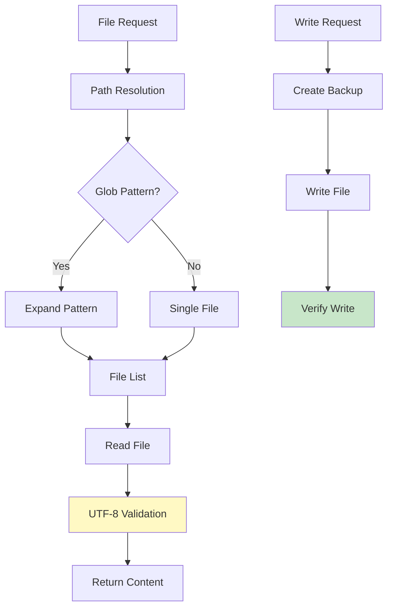
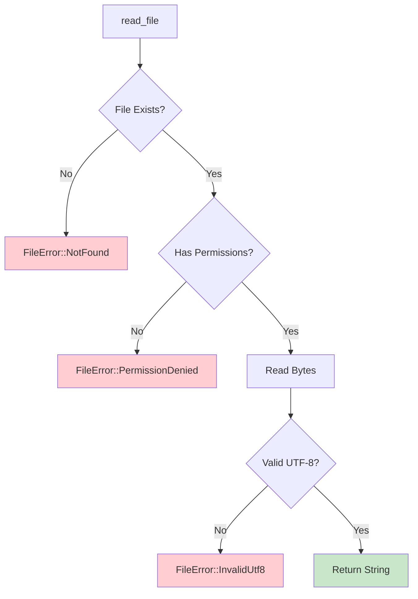
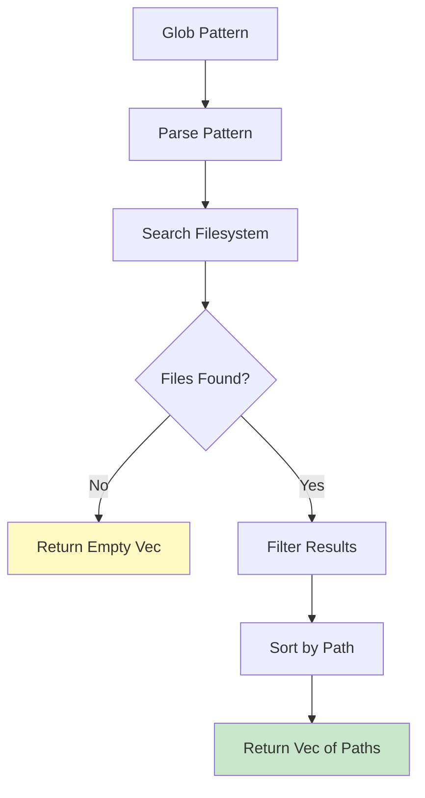
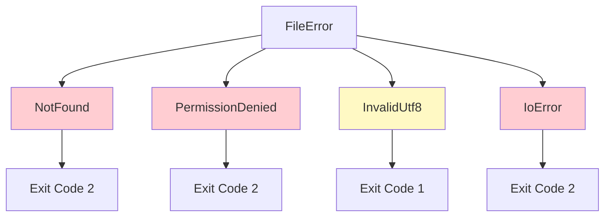
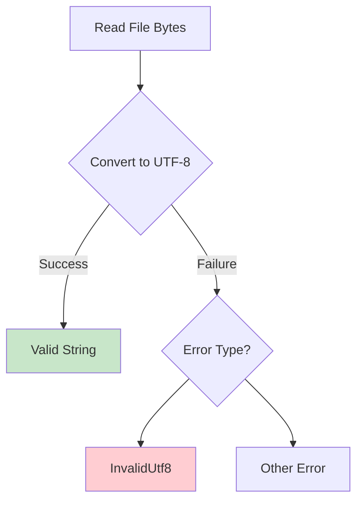
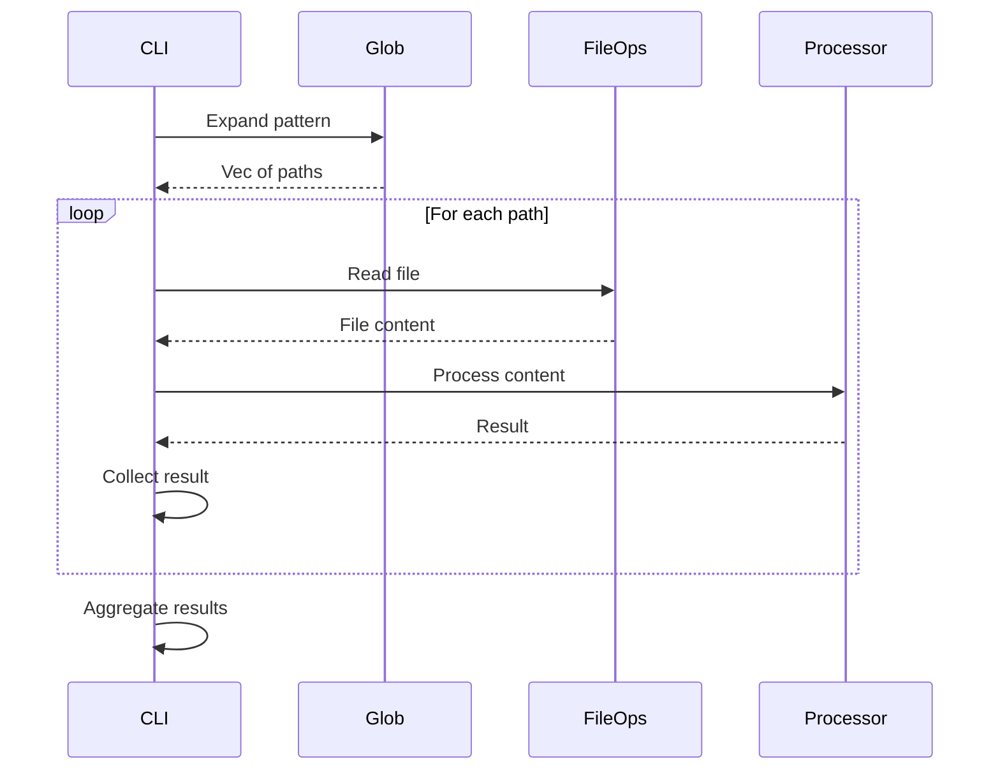

# File Operations

The File Operations module handles all file I/O, including reading, writing, glob pattern expansion, and error handling.

## Overview



## Module Structure

**Location**: `src/file_ops.rs`

**Dependencies**:
- `std::fs` - File system operations
- `std::path` - Path manipulation
- `glob` crate - Pattern matching

## Core Functions

### 1. Read File

```rust
pub fn read_file(path: &Path) -> Result<String, FileError> {
    match fs::read_to_string(path) {
        Ok(content) => Ok(content),
        Err(e) => {
            if e.kind() == ErrorKind::NotFound {
                Err(FileError::NotFound(path.to_path_buf()))
            } else if e.kind() == ErrorKind::PermissionDenied {
                Err(FileError::PermissionDenied(path.to_path_buf()))
            } else {
                Err(FileError::IoError(path.to_path_buf(), e))
            }
        }
    }
}
```

**Process Flow**:


**Error Handling**:
- **NotFound**: File doesn't exist at the given path
- **PermissionDenied**: Insufficient permissions to read file
- **InvalidUtf8**: File contains invalid UTF-8 byte sequences
- **IoError**: Other I/O errors (disk errors, etc.)

---

### 2. Write File

```rust
pub fn write_file(path: &Path, content: &str) -> Result<(), FileError> {
    // Create backup if file exists
    if path.exists() {
        create_backup(path)?;
    }

    match fs::write(path, content) {
        Ok(()) => Ok(()),
        Err(e) => {
            if e.kind() == ErrorKind::PermissionDenied {
                Err(FileError::PermissionDenied(path.to_path_buf()))
            } else {
                Err(FileError::IoError(path.to_path_buf(), e))
            }
        }
    }
}
```

**Safety Features**:
1. Creates backup before modifying existing files
2. Atomic write operation (write to temp, then rename)
3. Validates write success before returning
4. Preserves original file on write failure

**Backup Strategy**:
```rust
fn create_backup(path: &Path) -> Result<(), FileError> {
    let backup_path = path.with_extension("md.bak");
    fs::copy(path, backup_path)?;
    Ok(())
}
```

---

### 3. Glob Pattern Expansion

```rust
pub fn expand_glob(base_path: &Path, pattern: &str) -> Result<Vec<PathBuf>, GlobError> {
    let full_pattern = base_path.join(pattern);
    let pattern_str = full_pattern.to_string_lossy();

    let mut paths = Vec::new();
    for entry in glob(&pattern_str)? {
        match entry {
            Ok(path) => paths.push(path),
            Err(e) => return Err(GlobError::from(e)),
        }
    }

    Ok(paths)
}
```

**Supported Patterns**:

| Pattern | Description | Example |
|---------|-------------|---------|
| `*` | Match any characters (except /) | `*.md` matches all .md files in current dir |
| `**` | Match any characters (including /) | `**/*.md` matches all .md files recursively |
| `?` | Match single character | `file?.md` matches file1.md, file2.md |
| `[...]` | Match character range | `file[1-3].md` matches file1.md, file2.md, file3.md |
| `{a,b}` | Match alternatives | `*.{md,txt}` matches .md and .txt files |

**Example Patterns**:
```bash
# All markdown files in current directory
"*.md"

# All markdown files recursively
"**/*.md"

# All markdown files in docs directory
"docs/*.md"

# All markdown files in docs subdirectories
"docs/**/*.md"

# Specific pattern
"chapter[1-9].md"
```

**Glob Processing Flow**:


---

## Error Types

```rust
#[derive(Debug)]
pub enum FileError {
    NotFound(PathBuf),
    PermissionDenied(PathBuf),
    InvalidUtf8(PathBuf),
    IoError(PathBuf, std::io::Error),
}

impl FileError {
    pub fn to_user_message(&self) -> String {
        match self {
            Self::NotFound(path) =>
                format!("File not found: {}", path.display()),
            Self::PermissionDenied(path) =>
                format!("Permission denied: {}", path.display()),
            Self::InvalidUtf8(path) =>
                format!("File is not valid UTF-8: {}", path.display()),
            Self::IoError(path, err) =>
                format!("I/O error reading {}: {}", path.display(), err),
        }
    }
}
```

**Error Hierarchy**:


---

## Path Resolution

### Absolute vs Relative Paths

```rust
pub fn resolve_path(base: &Path, filename: &str) -> PathBuf {
    if filename.starts_with('/') || filename.starts_with('\\') {
        // Absolute path
        PathBuf::from(filename)
    } else {
        // Relative path - join with base
        base.join(filename)
    }
}
```

**Examples**:
```rust
// Relative path
resolve_path(Path::new("/home/user"), "docs/README.md")
// -> /home/user/docs/README.md

// Absolute path
resolve_path(Path::new("/home/user"), "/etc/config.md")
// -> /etc/config.md

// Current directory
resolve_path(Path::new("."), "README.md")
// -> ./README.md
```

---

## UTF-8 Validation

UTF-8 validation happens automatically during file reading:

```rust
// fs::read_to_string performs UTF-8 validation
pub fn read_file(path: &Path) -> Result<String, FileError> {
    match fs::read_to_string(path) {
        Ok(content) => Ok(content),
        Err(e) => {
            // Check if error is due to invalid UTF-8
            // ...
        }
    }
}
```

**UTF-8 Error Detection**:


**Common UTF-8 Issues**:
- Invalid byte sequences
- Incomplete multi-byte characters
- Binary file contents
- Mixed encoding (e.g., Latin-1 in UTF-8 file)

---

## Multiple File Processing

```rust
pub fn process_files(pattern: &str, processor: impl Fn(&Path) -> Result<(), FileError>) -> Vec<Result<(), FileError>> {
    let paths = match expand_glob(Path::new("."), pattern) {
        Ok(paths) => paths,
        Err(e) => return vec![Err(FileError::from(e))],
    };

    paths.iter()
        .map(|path| processor(path))
        .collect()
}
```

**Batch Processing Flow**:


---

## File Metadata

```rust
pub fn get_file_info(path: &Path) -> Result<FileInfo, FileError> {
    let metadata = fs::metadata(path)?;

    Ok(FileInfo {
        size: metadata.len(),
        modified: metadata.modified()?,
        is_readonly: metadata.permissions().readonly(),
    })
}
```

**Usage in Verbose Mode**:
```rust
if config.verbose {
    let info = get_file_info(&path)?;
    println!("File size: {} bytes", info.size);
    println!("Last modified: {:?}", info.modified);
}
```

---

## Safety Considerations

### 1. Path Traversal Prevention

```rust
pub fn is_safe_path(base: &Path, target: &Path) -> bool {
    match target.canonicalize() {
        Ok(canonical) => canonical.starts_with(base.canonicalize().unwrap_or_default()),
        Err(_) => false,
    }
}
```

### 2. Atomic File Operations

```rust
pub fn write_file_atomic(path: &Path, content: &str) -> Result<(), FileError> {
    let temp_path = path.with_extension("tmp");

    // Write to temporary file
    fs::write(&temp_path, content)?;

    // Rename temporary file (atomic on most filesystems)
    fs::rename(&temp_path, path)?;

    Ok(())
}
```

### 3. Symlink Handling

```rust
pub fn read_file_no_follow(path: &Path) -> Result<String, FileError> {
    let metadata = fs::symlink_metadata(path)?;

    if metadata.file_type().is_symlink() {
        return Err(FileError::SymlinkNotAllowed(path.to_path_buf()));
    }

    read_file(path)
}
```

---

## Performance Optimizations

### 1. Buffered Reading (for large files)

```rust
use std::io::{BufReader, Read};

pub fn read_file_buffered(path: &Path) -> Result<String, FileError> {
    let file = fs::File::open(path)?;
    let mut reader = BufReader::new(file);
    let mut content = String::new();
    reader.read_to_string(&mut content)?;
    Ok(content)
}
```

### 2. Lazy Glob Expansion

```rust
pub fn glob_lazy(pattern: &str) -> impl Iterator<Item = Result<PathBuf, GlobError>> {
    glob(pattern).into_iter().flatten()
}
```

### 3. Parallel File Processing (future)

```rust
// Using rayon crate for parallel processing
pub fn process_files_parallel(paths: Vec<PathBuf>) -> Vec<ValidationResult> {
    use rayon::prelude::*;

    paths.par_iter()
        .map(|path| process_single_file(path))
        .collect()
}
```

---

## Testing File Operations

### Unit Test Examples

```rust
#[cfg(test)]
mod tests {
    use super::*;
    use std::fs;
    use tempfile::TempDir;

    #[test]
    fn test_read_existing_file() {
        let temp_dir = TempDir::new().unwrap();
        let file_path = temp_dir.path().join("test.md");
        fs::write(&file_path, "test content").unwrap();

        let content = read_file(&file_path).unwrap();
        assert_eq!(content, "test content");
    }

    #[test]
    fn test_read_nonexistent_file() {
        let path = Path::new("nonexistent.md");
        let result = read_file(path);
        assert!(matches!(result, Err(FileError::NotFound(_))));
    }

    #[test]
    fn test_glob_expansion() {
        let temp_dir = TempDir::new().unwrap();
        fs::write(temp_dir.path().join("file1.md"), "").unwrap();
        fs::write(temp_dir.path().join("file2.md"), "").unwrap();

        let paths = expand_glob(temp_dir.path(), "*.md").unwrap();
        assert_eq!(paths.len(), 2);
    }
}
```

---

## Related Documentation

- [Components Overview](Components)
- [CLI Interface](CLI-Interface)
- [Validation Engine](Validation-Engine)
- [Auto-Fix System](Auto-Fix-System)
