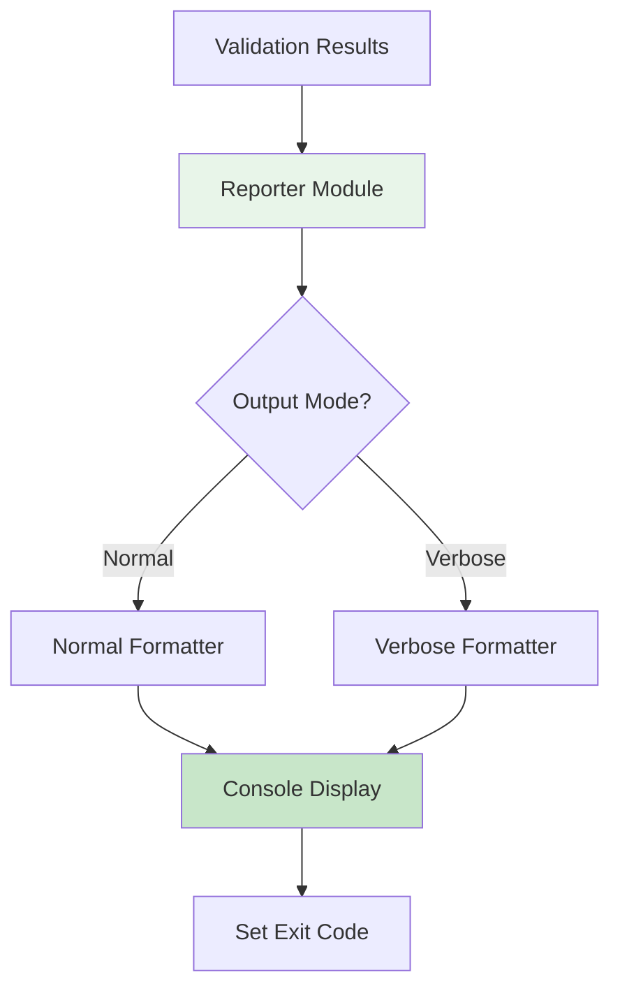
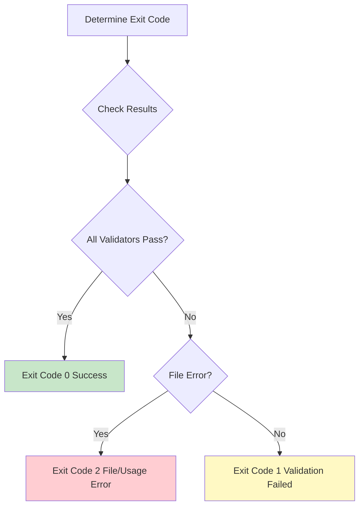

# Reporter Module

The Reporter Module is responsible for formatting validation results and displaying them to the user.

## Overview



## Module Structure

**Location**: `src/reporter.rs`

**Responsibilities**:
- Format validation results for display
- Handle normal and verbose output modes
- Display error details with line numbers
- Determine and set appropriate exit codes
- Provide user-friendly error messages

---

## Output Modes

### 1. Normal Mode

**Characteristics**:
- Concise output
- Shows only essential information
- One-line success message
- Detailed errors on failure

**Success Output**:
```
✓ File validation successful: ./README.md
```

**Failure Output**:
```
✗ File validation failed: ./README.md

ASCII Subset: ✗ Fail (2 errors)
  Line 15, Column 5: Non-ASCII character: '├' (U+251C)
  Line 23, Column 3: Non-ASCII character: '│' (U+2502)

Tree Symbols: ✗ Fail (2 errors)
  Line 15, Column 5: Tree symbol '├' (U+251C) detected. Use '+' or '|' instead
  Line 23, Column 3: Tree symbol '│' (U+2502) detected. Use '|' instead
```

---

### 2. Verbose Mode

**Characteristics**:
- Detailed progress information
- File metadata (size, path)
- Step-by-step validator execution
- Progress indicators
- Full error context

**Example Output**:
```
Checking file: ./README.md
File size: 1,234 bytes

Running validators...
[1/4] UTF-8 Encoding... ✓ Pass
[2/4] ASCII Subset... ✗ Fail (2 errors found)
[3/4] Printable Characters... ✓ Pass
[4/4] Tree Symbols... ✗ Fail (2 errors found)

Results:
✗ File validation failed: ./README.md

ASCII Subset: ✗ Fail (2 errors)
  Line 15, Column 5: Non-ASCII character: '├' (U+251C)
    Context: ├── src/
  Line 23, Column 3: Non-ASCII character: '│' (U+2502)
    Context: │   ├── main.rs

Tree Symbols: ✗ Fail (2 errors)
  Line 15, Column 5: Tree symbol '├' (U+251C) detected. Use '+' or '|' instead
    Context: ├── src/
  Line 23, Column 3: Tree symbol '│' (U+2502) detected. Use '|' instead
    Context: │   ├── main.rs
```

---

## Implementation

### Core Functions

#### 1. Report Results

```rust
pub fn report_results(
    results: &[ValidationResult],
    file_path: &Path,
    verbose: bool
) -> i32 {
    let overall_status = determine_overall_status(results);

    if verbose {
        report_verbose(results, file_path, &overall_status)
    } else {
        report_normal(results, file_path, &overall_status)
    }
}
```

---

#### 2. Normal Report

```rust
fn report_normal(
    results: &[ValidationResult],
    file_path: &Path,
    status: &ValidationStatus
) -> i32 {
    match status {
        ValidationStatus::Pass => {
            println!("✓ File validation successful: {}", file_path.display());
            0
        }
        ValidationStatus::Fail => {
            println!("✗ File validation failed: {}\n", file_path.display());
            display_failures(results);
            1
        }
    }
}
```

---

#### 3. Verbose Report

```rust
fn report_verbose(
    results: &[ValidationResult],
    file_path: &Path,
    status: &ValidationStatus
) -> i32 {
    // File info
    println!("Checking file: {}", file_path.display());
    if let Ok(metadata) = fs::metadata(file_path) {
        println!("File size: {} bytes\n", metadata.len());
    }

    // Progress
    println!("Running validators...");
    display_validator_progress(results);

    // Results
    println!("\nResults:");
    match status {
        ValidationStatus::Pass => {
            println!("✓ File validation successful: {}", file_path.display());
            0
        }
        ValidationStatus::Fail => {
            println!("✗ File validation failed: {}\n", file_path.display());
            display_failures_verbose(results);
            1
        }
    }
}
```

---

#### 4. Display Failures

```rust
fn display_failures(results: &[ValidationResult]) {
    for result in results {
        if result.status == ValidationStatus::Fail {
            println!("{}: ✗ Fail ({} errors)",
                result.validator_name,
                result.errors.len()
            );

            for error in &result.errors {
                if let Some(col) = error.column {
                    println!("  Line {}, Column {}: {}",
                        error.line_number, col, error.message
                    );
                } else {
                    println!("  Line {}: {}",
                        error.line_number, error.message
                    );
                }
            }
            println!();
        }
    }
}
```

---

#### 5. Display Validator Progress

```rust
fn display_validator_progress(results: &[ValidationResult]) {
    for (index, result) in results.iter().enumerate() {
        let num = index + 1;
        let total = results.len();
        let status_symbol = match result.status {
            ValidationStatus::Pass => "✓ Pass",
            ValidationStatus::Fail =>
                &format!("✗ Fail ({} errors found)", result.errors.len()),
        };

        println!("[{}/{}] {}... {}",
            num, total, result.validator_name, status_symbol
        );
    }
}
```

---

## Output Formatting

### Status Indicators

```rust
const PASS_SYMBOL: &str = "✓";
const FAIL_SYMBOL: &str = "✗";

fn format_status(status: &ValidationStatus) -> String {
    match status {
        ValidationStatus::Pass => format!("{} Pass", PASS_SYMBOL),
        ValidationStatus::Fail => format!("{} Fail", FAIL_SYMBOL),
    }
}
```

### Color Support (future enhancement)

```rust
use colored::*;

fn format_status_colored(status: &ValidationStatus) -> ColoredString {
    match status {
        ValidationStatus::Pass =>
            "✓ Pass".green(),
        ValidationStatus::Fail =>
            "✗ Fail".red(),
    }
}
```

---

## Exit Code Management



### Exit Code Definitions

```rust
pub mod exit_codes {
    pub const SUCCESS: i32 = 0;
    pub const VALIDATION_FAILED: i32 = 1;
    pub const FILE_ERROR: i32 = 2;
}

pub fn determine_exit_code(
    results: &[ValidationResult],
    file_error: Option<&FileError>
) -> i32 {
    if let Some(_) = file_error {
        return exit_codes::FILE_ERROR;
    }

    let overall = determine_overall_status(results);
    match overall {
        ValidationStatus::Pass => exit_codes::SUCCESS,
        ValidationStatus::Fail => exit_codes::VALIDATION_FAILED,
    }
}
```

---

## Error Context Display

### With Context

```rust
fn display_error_with_context(error: &ValidationError) {
    println!("  Line {}, Column {}: {}",
        error.line_number,
        error.column.unwrap_or(0),
        error.message
    );

    if let Some(context) = &error.context {
        println!("    Context: {}", context);

        // Visual indicator of column position
        if let Some(col) = error.column {
            let spaces = " ".repeat(col - 1);
            println!("             {}^", spaces);
        }
    }
}
```

**Example Output**:
```
  Line 15, Column 5: Tree symbol '├' (U+251C) detected
    Context: ├── src/
             ^
```

---

## Multiple File Reporting

### Summary Report

```rust
pub fn report_multiple_files(
    file_results: &[(PathBuf, Vec<ValidationResult>)]
) -> i32 {
    let mut all_passed = true;
    let mut total_violations = 0;

    for (path, results) in file_results {
        let status = determine_overall_status(results);

        match status {
            ValidationStatus::Pass => {
                println!("✓ {}", path.display());
            }
            ValidationStatus::Fail => {
                all_passed = false;
                let error_count: usize = results.iter()
                    .map(|r| r.errors.len())
                    .sum();
                total_violations += error_count;

                println!("✗ {} ({} violations)",
                    path.display(), error_count
                );
            }
        }
    }

    println!("\nSummary:");
    println!("  Total files: {}", file_results.len());
    println!("  Passed: {}",
        file_results.iter()
            .filter(|(_, r)| determine_overall_status(r) == ValidationStatus::Pass)
            .count()
    );
    println!("  Failed: {}",
        file_results.iter()
            .filter(|(_, r)| determine_overall_status(r) == ValidationStatus::Fail)
            .count()
    );
    println!("  Total violations: {}", total_violations);

    if all_passed { 0 } else { 1 }
}
```

**Example Output**:
```
✓ ./README.md
✗ ./docs/API.md (3 violations)
✓ ./CONTRIBUTING.md
✗ ./docs/guide.md (1 violation)

Summary:
  Total files: 4
  Passed: 2
  Failed: 2
  Total violations: 4
```

---

## Fix Mode Reporting

### Fix Success

```rust
pub fn report_fix_success(path: &Path, fix_count: usize) {
    println!("✓ Fixed {} violations in: {}",
        fix_count, path.display()
    );
}
```

**Output**:
```
✓ Fixed 3 violations in: ./README.md
```

---

### Dry-Run Report

```rust
pub fn report_dry_run(preview: &FixPreview) {
    println!("Would fix {} violations:\n", preview.violation_count);

    for change in &preview.changes {
        println!("  Line {}, Column {}: '{}' -> '{}'",
            change.line,
            change.column,
            change.from,
            change.to
        );
        println!("    Before: {}", change.before_line);
        println!("    After:  {}", change.after_line);
        println!();
    }

    println!("(File not modified - dry run)");
}
```

**Output**:
```
Would fix 3 violations:

  Line 15, Column 5: '├' -> '+'
    Before: ├── src/
    After:  +-- src/

  Line 23, Column 3: '│' -> '|'
    Before: │   ├── main.rs
    After:  |   +-- main.rs

  Line 23, Column 7: '└' -> '+'
    Before: │   └── lib.rs
    After:  |   +-- lib.rs

(File not modified - dry run)
```

---

### Unfixable Report

```rust
pub fn report_unfixable(violations: &[ValidationError]) {
    println!("✗ Cannot auto-fix: file contains unfixable violations\n");
    println!("The following violations cannot be automatically fixed:");

    for violation in violations {
        println!("  Line {}: {}", violation.line_number, violation.message);
    }

    println!("\nPlease fix these violations manually.");
}
```

**Output**:
```
✗ Cannot auto-fix: file contains unfixable violations

The following violations cannot be automatically fixed:
  Line 10: Non-ASCII character: '😀' (U+1F600)
  Line 25: Non-ASCII character: 'é' (U+00E9)

Please fix these violations manually.
```

---

## Progress Indicators

### Spinner (future enhancement)

```rust
pub struct ProgressSpinner {
    message: String,
    frames: Vec<&'static str>,
    current_frame: usize,
}

impl ProgressSpinner {
    pub fn new(message: &str) -> Self {
        Self {
            message: message.to_string(),
            frames: vec!["⠋", "⠙", "⠹", "⠸", "⠼", "⠴", "⠦", "⠧", "⠇", "⠏"],
            current_frame: 0,
        }
    }

    pub fn tick(&mut self) {
        print!("\r{} {}", self.frames[self.current_frame], self.message);
        self.current_frame = (self.current_frame + 1) % self.frames.len();
    }
}
```

---

## Testing Reporter

### Unit Tests

```rust
#[cfg(test)]
mod tests {
    use super::*;

    #[test]
    fn test_exit_code_success() {
        let results = vec![
            ValidationResult {
                status: ValidationStatus::Pass,
                validator_name: "Test".to_string(),
                errors: vec![],
            }
        ];

        assert_eq!(determine_exit_code(&results, None), 0);
    }

    #[test]
    fn test_exit_code_failure() {
        let results = vec![
            ValidationResult {
                status: ValidationStatus::Fail,
                validator_name: "Test".to_string(),
                errors: vec![
                    ValidationError {
                        line_number: 1,
                        column: Some(1),
                        message: "Error".to_string(),
                        context: None,
                    }
                ],
            }
        ];

        assert_eq!(determine_exit_code(&results, None), 1);
    }
}
```

---

## Output Examples

### Example 1: Success (Normal)

```bash
$ markdown-checker
✓ File validation successful: ./README.md
```

---

### Example 2: Success (Verbose)

```bash
$ markdown-checker -v
Checking file: ./README.md
File size: 1,234 bytes

Running validators...
[1/4] UTF-8 Encoding... ✓ Pass
[2/4] ASCII Subset... ✓ Pass
[3/4] Printable Characters... ✓ Pass
[4/4] Tree Symbols... ✓ Pass

Results:
✓ File validation successful: ./README.md
```

---

### Example 3: Failure (Normal)

```bash
$ markdown-checker
✗ File validation failed: ./README.md

Tree Symbols: ✗ Fail (2 errors)
  Line 15, Column 5: Tree symbol '├' (U+251C) detected. Use '+' or '|' instead
  Line 23, Column 3: Tree symbol '│' (U+2502) detected. Use '|' instead
```

---

### Example 4: Glob Pattern (Multiple Files)

```bash
$ markdown-checker -f "docs/**/*.md"
✓ ./docs/README.md
✗ ./docs/API.md (3 violations)
✓ ./docs/guide.md
✗ ./docs/reference.md (1 violation)

Summary:
  Total files: 4
  Passed: 2
  Failed: 2
  Total violations: 4
```

---

## Related Documentation

- [Components Overview](Components)
- [CLI Interface](CLI-Interface)
- [Workflows & Sequences](Workflows)
- [Auto-Fix System](Auto-Fix-System)
