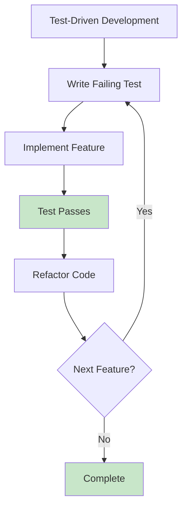
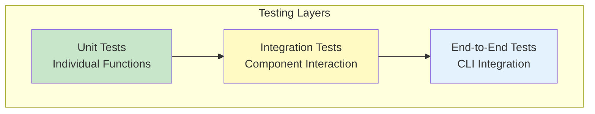

# Testing Strategy

Markdown Checker follows Test-Driven Development (TDD) principles with comprehensive unit and integration testing.

## Overview



## Testing Pyramid



### Test Distribution

- **Unit Tests**: ~70% of tests
  - Individual validators
  - Helper functions
  - Data structures

- **Integration Tests**: ~20% of tests
  - File operations with validators
  - CLI argument parsing
  - Complete validation workflows

- **End-to-End Tests**: ~10% of tests
  - Full CLI execution
  - Multi-file processing
  - Fix workflows

---

## Unit Testing

### Test Structure

```rust
#[cfg(test)]
mod tests {
    use super::*;

    #[test]
    fn test_name() {
        // Arrange
        let input = create_test_data();

        // Act
        let result = function_under_test(input);

        // Assert
        assert_eq!(result, expected_output);
    }
}
```

---

### Validator Tests

#### ASCII Validator Tests

```rust
#[cfg(test)]
mod ascii_validator_tests {
    use super::*;

    #[test]
    fn test_valid_ascii_content() {
        let validator = AsciiValidator;
        let content = "This is valid ASCII content.\nWith multiple lines.";

        let result = validator.validate(content);

        assert_eq!(result.status, ValidationStatus::Pass);
        assert_eq!(result.errors.len(), 0);
    }

    #[test]
    fn test_detects_unicode_characters() {
        let validator = AsciiValidator;
        let content = "This has unicode: ├";

        let result = validator.validate(content);

        assert_eq!(result.status, ValidationStatus::Fail);
        assert_eq!(result.errors.len(), 1);
        assert_eq!(result.errors[0].line_number, 1);
    }

    #[test]
    fn test_reports_correct_line_numbers() {
        let validator = AsciiValidator;
        let content = "Line 1\nLine 2 with ├\nLine 3";

        let result = validator.validate(content);

        assert_eq!(result.errors.len(), 1);
        assert_eq!(result.errors[0].line_number, 2);
    }

    #[test]
    fn test_reports_correct_column_numbers() {
        let validator = AsciiValidator;
        let content = "Text ├ more";

        let result = validator.validate(content);

        assert_eq!(result.errors[0].column, Some(6));
    }
}
```

---

#### Tree Symbol Validator Tests

```rust
#[cfg(test)]
mod tree_symbol_validator_tests {
    use super::*;

    #[test]
    fn test_detects_tree_symbols() {
        let validator = TreeSymbolValidator;
        let symbols = vec!['├', '└', '│', '─', '┌', '┐', '┘'];

        for symbol in symbols {
            let content = format!("Text {} more", symbol);
            let result = validator.validate(&content);

            assert_eq!(result.status, ValidationStatus::Fail,
                "Failed to detect symbol: {}", symbol);
        }
    }

    #[test]
    fn test_provides_suggestions() {
        let validator = TreeSymbolValidator;
        let content = "├── src/";

        let result = validator.validate(content);

        assert!(result.errors[0].message.contains("Use"));
        assert!(result.errors[0].message.contains("instead"));
    }

    #[test]
    fn test_ignores_ascii_alternatives() {
        let validator = TreeSymbolValidator;
        let content = "+-- src/\n|   +-- main.rs";

        let result = validator.validate(content);

        assert_eq!(result.status, ValidationStatus::Pass);
    }
}
```

---

#### Unprintable Validator Tests

```rust
#[cfg(test)]
mod unprintable_validator_tests {
    use super::*;

    #[test]
    fn test_allows_printable_ascii() {
        let validator = UnprintableValidator;
        let content = "ABCDEFGHIJKLMNOPQRSTUVWXYZabcdefghijklmnopqrstuvwxyz0123456789!@#$%^&*()";

        let result = validator.validate(content);

        assert_eq!(result.status, ValidationStatus::Pass);
    }

    #[test]
    fn test_allows_standard_whitespace() {
        let validator = UnprintableValidator;
        let content = "Text with spaces\tand tabs\nand newlines\r\n";

        let result = validator.validate(content);

        assert_eq!(result.status, ValidationStatus::Pass);
    }

    #[test]
    fn test_detects_null_bytes() {
        let validator = UnprintableValidator;
        let content = "Text\0with null";

        let result = validator.validate(content);

        assert_eq!(result.status, ValidationStatus::Fail);
    }

    #[test]
    fn test_detects_control_characters() {
        let validator = UnprintableValidator;
        let content = "Text\x07with bell";

        let result = validator.validate(content);

        assert_eq!(result.status, ValidationStatus::Fail);
    }
}
```

---

### Auto-Fix Tests

```rust
#[cfg(test)]
mod fixer_tests {
    use super::*;

    #[test]
    fn test_fixes_tree_symbols() {
        let content = "├── src/\n│   └── main.rs";
        let results = validate_all(content);

        let fixed = apply_fixes(content, &results).unwrap();

        assert_eq!(fixed, "+-- src/\n|   +-- main.rs");
    }

    #[test]
    fn test_verify_fix_passes() {
        let content = "├── src/";
        let results = validate_all(content);
        let fixed = apply_fixes(content, &results).unwrap();

        assert!(verify_fix(&fixed).is_ok());
    }

    #[test]
    fn test_cannot_fix_emojis() {
        let content = "Hello 😀";
        let results = validate_all(content);

        let result = apply_fixes(content, &results);

        assert!(matches!(result, Err(FixError::ContainsUnfixable(_))));
    }

    #[test]
    fn test_fixability_analysis() {
        let content = "├── src/ with emoji 😀";
        let results = validate_all(content);
        let analysis = can_fix(&results);

        assert!(!analysis.all_fixable);
        assert!(analysis.fixable_count > 0);
        assert!(analysis.unfixable_count > 0);
    }
}
```

---

## Integration Testing

### File Operations Integration

```rust
#[cfg(test)]
mod file_ops_integration_tests {
    use super::*;
    use tempfile::TempDir;

    #[test]
    fn test_read_and_validate() {
        let temp_dir = TempDir::new().unwrap();
        let file_path = temp_dir.path().join("test.md");

        fs::write(&file_path, "Valid ASCII content").unwrap();

        let content = read_file(&file_path).unwrap();
        let results = validate_all(&content);

        assert_eq!(determine_overall_status(&results), ValidationStatus::Pass);
    }

    #[test]
    fn test_fix_and_write() {
        let temp_dir = TempDir::new().unwrap();
        let file_path = temp_dir.path().join("test.md");

        fs::write(&file_path, "├── src/").unwrap();

        let content = read_file(&file_path).unwrap();
        let results = validate_all(&content);
        let fixed = apply_fixes(&content, &results).unwrap();
        write_file(&file_path, &fixed).unwrap();

        let new_content = read_file(&file_path).unwrap();
        assert_eq!(new_content, "+-- src/");
    }
}
```

---

### CLI Integration

```rust
#[cfg(test)]
mod cli_integration_tests {
    use super::*;

    #[test]
    fn test_parse_default_arguments() {
        let cli = Cli::parse_from(vec!["markdown-checker"]);

        assert_eq!(cli.path, PathBuf::from("."));
        assert_eq!(cli.file_name, "README.md");
        assert!(!cli.verbose);
    }

    #[test]
    fn test_parse_custom_path() {
        let cli = Cli::parse_from(vec!["markdown-checker", "-p", "docs"]);

        assert_eq!(cli.path, PathBuf::from("docs"));
    }

    #[test]
    fn test_parse_verbose_flag() {
        let cli = Cli::parse_from(vec!["markdown-checker", "-v"]);

        assert!(cli.verbose);
    }

    #[test]
    fn test_parse_fix_flag() {
        let cli = Cli::parse_from(vec!["markdown-checker", "--fix"]);

        assert!(cli.fix);
    }
}
```

---

## End-to-End Testing

### Complete Workflow Tests

```rust
#[cfg(test)]
mod e2e_tests {
    use super::*;
    use std::process::Command;
    use tempfile::TempDir;

    #[test]
    fn test_cli_validates_file() {
        let temp_dir = TempDir::new().unwrap();
        let file_path = temp_dir.path().join("README.md");
        fs::write(&file_path, "Valid content").unwrap();

        let output = Command::new("./target/debug/markdown-checker")
            .arg("-p")
            .arg(temp_dir.path())
            .output()
            .unwrap();

        assert!(output.status.success());
        assert!(String::from_utf8_lossy(&output.stdout)
            .contains("validation successful"));
    }

    #[test]
    fn test_cli_detects_violations() {
        let temp_dir = TempDir::new().unwrap();
        let file_path = temp_dir.path().join("README.md");
        fs::write(&file_path, "├── src/").unwrap();

        let output = Command::new("./target/debug/markdown-checker")
            .arg("-p")
            .arg(temp_dir.path())
            .output()
            .unwrap();

        assert!(!output.status.success());
        assert!(String::from_utf8_lossy(&output.stdout)
            .contains("validation failed"));
    }

    #[test]
    fn test_cli_fix_mode() {
        let temp_dir = TempDir::new().unwrap();
        let file_path = temp_dir.path().join("README.md");
        fs::write(&file_path, "├── src/").unwrap();

        let output = Command::new("./target/debug/markdown-checker")
            .arg("-p")
            .arg(temp_dir.path())
            .arg("--fix")
            .output()
            .unwrap();

        assert!(output.status.success());

        let content = fs::read_to_string(&file_path).unwrap();
        assert_eq!(content, "+-- src/");
    }
}
```

---

## Test Fixtures

### Directory Structure

```
tests/
├── fixtures/
│   ├── valid.md              # Passes all validations
│   ├── non_ascii.md          # Contains Unicode characters
│   ├── tree_chars.md         # Contains tree symbols
│   ├── unprintable.md        # Contains control characters
│   ├── mixed_violations.md   # Multiple violation types
│   └── example_output.md     # Expected output examples
├── unit/
│   ├── validator_tests.rs
│   ├── fixer_tests.rs
│   └── file_ops_tests.rs
└── integration/
    ├── cli_tests.rs
    └── e2e_tests.rs
```

---

### Example Fixture: valid.md

```markdown
# Valid Markdown

This file contains only ASCII characters.

## Directory Structure

+-- src/
    +-- main.rs
    +-- lib.rs

All validations should pass.
```

---

### Example Fixture: tree_chars.md

```markdown
# Directory Structure

├── src/
│   ├── main.rs
│   └── lib.rs
└── tests/
```

---

## Test Coverage

### Coverage Goals

- **Unit Tests**: >90% code coverage
- **Integration Tests**: All major workflows
- **E2E Tests**: All CLI operations

### Running Coverage

```bash
# Install tarpaulin
cargo install cargo-tarpaulin

# Run coverage
cargo tarpaulin --out Html --output-dir coverage
```

---

## Continuous Testing

### Pre-Commit Hook

```bash
#!/bin/bash
# .git/hooks/pre-commit

echo "Running tests..."
cargo test --quiet

if [ $? -ne 0 ]; then
    echo "Tests failed. Commit aborted."
    exit 1
fi

echo "Running clippy..."
cargo clippy -- -D warnings

if [ $? -ne 0 ]; then
    echo "Clippy failed. Commit aborted."
    exit 1
fi

exit 0
```

---

### CI/CD Pipeline

```yaml
# .github/workflows/test.yml
name: Test

on: [push, pull_request]

jobs:
  test:
    runs-on: ubuntu-latest
    steps:
      - uses: actions/checkout@v2
      - uses: actions-rs/toolchain@v1
        with:
          toolchain: stable
      - name: Run tests
        run: cargo test --verbose
      - name: Run clippy
        run: cargo clippy -- -D warnings
      - name: Check formatting
        run: cargo fmt -- --check
```

---

## Test Execution

### Running All Tests

```bash
cargo test
```

---

### Running Specific Tests

```bash
# Single test
cargo test test_valid_ascii_content

# Test module
cargo test ascii_validator_tests

# Integration tests only
cargo test --test '*'
```

---

### Running with Output

```bash
# Show println! output
cargo test -- --nocapture

# Show test names
cargo test -- --test-threads=1
```

---

### Running with Coverage

```bash
cargo tarpaulin --ignore-tests --out Html
```

---

## Performance Testing

### Benchmark Tests

```rust
#[cfg(test)]
mod benchmarks {
    use super::*;
    use std::time::Instant;

    #[test]
    fn bench_validate_large_file() {
        let content = "a".repeat(1_000_000); // 1MB of ASCII

        let start = Instant::now();
        let results = validate_all(&content);
        let duration = start.elapsed();

        println!("Validation took: {:?}", duration);
        assert!(duration.as_millis() < 100); // Should complete in <100ms
    }
}
```

---

## Test Best Practices

### 1. Descriptive Test Names

```rust
// Good
#[test]
fn test_ascii_validator_detects_unicode_at_correct_line_number()

// Bad
#[test]
fn test_validator()
```

---

### 2. Arrange-Act-Assert Pattern

```rust
#[test]
fn test_example() {
    // Arrange - set up test data
    let validator = AsciiValidator;
    let content = "test content";

    // Act - perform the action
    let result = validator.validate(content);

    // Assert - verify the result
    assert_eq!(result.status, ValidationStatus::Pass);
}
```

---

### 3. Test One Thing

```rust
// Good - tests one specific behavior
#[test]
fn test_detects_unicode_characters() { ... }

#[test]
fn test_reports_correct_line_numbers() { ... }

// Bad - tests multiple things
#[test]
fn test_everything() { ... }
```

---

### 4. Use Test Helpers

```rust
#[cfg(test)]
mod test_helpers {
    pub fn create_temp_file(content: &str) -> TempFile {
        // Helper logic
    }

    pub fn assert_validation_failed(results: &[ValidationResult]) {
        // Helper logic
    }
}
```

---

## Related Documentation

- [Development Process](Development-Process.md)
- [Components Overview](Components.md)
- [Validation Engine](Validation-Engine.md)
