# Validation Engine

The Validation Engine is the core component that checks file content against multiple validation rules.

## Architecture


## Validator Trait

The foundation of the validation system is the `Validator` trait:

```rust
pub trait Validator {
    /// Returns the human-readable name of this validator
    fn name(&self) -> &str;

    /// Validates the given content and returns results
    fn validate(&self, content: &str) -> ValidationResult;
}
```

### Benefits of the Trait

- **Extensibility**: Easy to add new validators
- **Testability**: Each validator can be tested independently
- **Consistency**: All validators return the same result format
- **Composability**: Validators can be composed and chained

## Validation Result Types

### ValidationResult

```rust
pub struct ValidationResult {
    pub status: ValidationStatus,
    pub validator_name: String,
    pub errors: Vec<ValidationError>,
}
```

### ValidationError

```rust
pub struct ValidationError {
    pub line_number: usize,
    pub column: Option<usize>,
    pub message: String,
    pub context: Option<String>,
}
```

### ValidationStatus

```rust
pub enum ValidationStatus {
    Pass,
    Fail,
}
```

## Validator Implementations

### 1. UTF-8 Validator

**Location**: `src/validators/utf8.rs`

**Purpose**: Ensure file content is valid UTF-8

**Implementation Details**:
```rust
pub struct Utf8Validator;

impl Validator for Utf8Validator {
    fn name(&self) -> &str {
        "UTF-8 Encoding"
    }

    fn validate(&self, content: &str) -> ValidationResult {
        // Since content is &str, it's already valid UTF-8
        // Actual validation happens during file reading
        ValidationResult {
            status: ValidationStatus::Pass,
            validator_name: self.name().to_string(),
            errors: vec![],
        }
    }
}
```

**Note**: Primary UTF-8 validation occurs in `file_ops.rs` when converting bytes to string.

---

### 2. ASCII Validator

**Location**: `src/validators/ascii.rs`

**Purpose**: Detect characters outside ASCII range (0-127)

**Algorithm**:


**Implementation**:
```rust
impl Validator for AsciiValidator {
    fn name(&self) -> &str {
        "ASCII Subset"
    }

    fn validate(&self, content: &str) -> ValidationResult {
        let mut errors = Vec::new();

        for (line_num, line) in content.lines().enumerate() {
            for (col, ch) in line.chars().enumerate() {
                if ch as u32 > 127 {
                    errors.push(ValidationError {
                        line_number: line_num + 1,
                        column: Some(col + 1),
                        message: format!(
                            "Non-ASCII character: '{}' (U+{:04X})",
                            ch, ch as u32
                        ),
                        context: Some(line.to_string()),
                    });
                }
            }
        }

        ValidationResult {
            status: if errors.is_empty() {
                ValidationStatus::Pass
            } else {
                ValidationStatus::Fail
            },
            validator_name: self.name().to_string(),
            errors,
        }
    }
}
```

**Example Violations**:
- Emojis: 😀 (U+1F600)
- Accented characters: é (U+00E9), ñ (U+00F1)
- Box-drawing: ├ (U+251C), │ (U+2502)
- Mathematical: π (U+03C0), ∑ (U+2211)

---

### 3. Unprintable Validator

**Location**: `src/validators/unprintable.rs`

**Purpose**: Detect control characters and unprintable bytes

**Allowed Characters**:
```rust
const ALLOWED_WHITESPACE: &[char] = &[
    ' ',   // Space (32)
    '\t',  // Tab (9)
    '\n',  // Newline (10)
    '\r',  // Carriage return (13)
];

fn is_printable(ch: char) -> bool {
    let code = ch as u32;
    // Printable ASCII range: 32-126
    (code >= 32 && code <= 126) || ALLOWED_WHITESPACE.contains(&ch)
}
```

**Character Ranges**:

```mermaid
graph LR
    subgraph "ASCII Codes"
        A[0-8 Control Chars ❌]
        B[9 Tab ✓]
        C[10 Newline ✓]
        D[11-12 Control Chars ❌]
        E[13 Carriage Return ✓]
        F[14-31 Control Chars ❌]
        G[32-126 Printable ✓]
        H[127 Delete ❌]
    end

    style B fill:#c8e6c9
    style C fill:#c8e6c9
    style E fill:#c8e6c9
    style G fill:#c8e6c9
    style A fill:#ffcdd2
    style D fill:#ffcdd2
    style F fill:#ffcdd2
    style H fill:#ffcdd2
```


**Example Violations**:
- Null byte: \0 (U+0000)
- Bell: \a (U+0007)
- Vertical tab: \v (U+000B)
- Form feed: \f (U+000C)
- Delete: (U+007F)

---

### 4. Tree Symbol Validator

**Location**: `src/validators/tree_symbols.rs`

**Purpose**: Detect box-drawing characters used in directory trees

**Detected Symbols**:

Box Drawing Unicode Block (U+2500 - U+257F):
```
├ └ │ ─ ┌ ┐ ┘ ┤ ┴ ┬ ┼
╭ ╮ ╯ ╰ ╱ ╲ ╳
```

**Detection Logic**:
```rust
const TREE_SYMBOLS: &[char] = &[
    '├', '└', '│', '─', '┌', '┐', '┘', '┤',
    '┴', '┬', '┼', '╭', '╮', '╯', '╰',
];

fn is_tree_symbol(ch: char) -> bool {
    TREE_SYMBOLS.contains(&ch) ||
    (ch as u32 >= 0x2500 && ch as u32 <= 0x257F)
}
```

**Suggestions**:
```rust
fn suggest_alternative(ch: char) -> String {
    match ch {
        '├' | '┤' => "Use '+' or '|' instead",
        '└' | '┘' | '┌' | '┐' => "Use '+' or '`' instead",
        '│' => "Use '|' instead",
        '─' => "Use '-' instead",
        _ => "Use standard ASCII characters like |, +, -, `",
    }.to_string()
}
```

**Example Output**:
```
Tree Symbols: ✗ Fail (3 errors)
  Line 15, Column 5: Tree symbol '├' (U+251C) detected. Use '+' or '|' instead
  Line 23, Column 3: Tree symbol '│' (U+2502) detected. Use '|' instead
  Line 23, Column 7: Tree symbol '└' (U+2514) detected. Use '+' or '`' instead
```

---

## Validation Execution Flow


## Results Aggregation

```rust
pub fn validate_all(content: &str) -> Vec<ValidationResult> {
    let validators: Vec<Box<dyn Validator>> = vec![
        Box::new(Utf8Validator),
        Box::new(AsciiValidator),
        Box::new(UnprintableValidator),
        Box::new(TreeSymbolValidator),
    ];

    validators.iter()
        .map(|v| v.validate(content))
        .collect()
}

pub fn determine_overall_status(results: &[ValidationResult]) -> ValidationStatus {
    if results.iter().all(|r| r.status == ValidationStatus::Pass) {
        ValidationStatus::Pass
    } else {
        ValidationStatus::Fail
    }
}
```

## Performance Characteristics

### Single-Pass Processing

Each validator processes the content independently:
- **UTF-8**: Validated during file read
- **ASCII**: Single pass through characters
- **Unprintable**: Single pass through characters
- **Tree Symbols**: Single pass through characters

### Optimization Opportunities

**Current**: Each validator iterates independently
```rust
// ASCII validator
for (line_num, line) in content.lines().enumerate() {
    for (col, ch) in line.chars().enumerate() {
        // Check ASCII
    }
}

// Unprintable validator
for (line_num, line) in content.lines().enumerate() {
    for (col, ch) in line.chars().enumerate() {
        // Check printable
    }
}
```

**Potential**: Combined single-pass validation (future enhancement)
```rust
for (line_num, line) in content.lines().enumerate() {
    for (col, ch) in line.chars().enumerate() {
        // Run all character-level checks
    }
}
```

## Extending with New Validators

### Step 1: Create Validator Struct

```rust
// src/validators/custom.rs
pub struct CustomValidator;
```

### Step 2: Implement Validator Trait

```rust
impl Validator for CustomValidator {
    fn name(&self) -> &str {
        "Custom Validation Rule"
    }

    fn validate(&self, content: &str) -> ValidationResult {
        let mut errors = Vec::new();

        // Your validation logic here

        ValidationResult {
            status: if errors.is_empty() {
                ValidationStatus::Pass
            } else {
                ValidationStatus::Fail
            },
            validator_name: self.name().to_string(),
            errors,
        }
    }
}
```

### Step 3: Register Validator

```rust
// Add to validate_all() function
let validators: Vec<Box<dyn Validator>> = vec![
    Box::new(Utf8Validator),
    Box::new(AsciiValidator),
    Box::new(UnprintableValidator),
    Box::new(TreeSymbolValidator),
    Box::new(CustomValidator), // New validator
];
```

## Testing Validators

### Unit Test Structure

```rust
#[cfg(test)]
mod tests {
    use super::*;

    #[test]
    fn test_valid_content() {
        let validator = AsciiValidator;
        let content = "Valid ASCII content";
        let result = validator.validate(content);
        assert_eq!(result.status, ValidationStatus::Pass);
        assert_eq!(result.errors.len(), 0);
    }

    #[test]
    fn test_invalid_content() {
        let validator = AsciiValidator;
        let content = "Invalid content: ├";
        let result = validator.validate(content);
        assert_eq!(result.status, ValidationStatus::Fail);
        assert_eq!(result.errors.len(), 1);
    }
}
```

## Error Reporting Format

Each validator provides detailed error information:

```rust
ValidationError {
    line_number: 15,              // 1-indexed
    column: Some(5),               // 1-indexed
    message: "Tree symbol '├' (U+251C) detected. Use '+' or '|' instead",
    context: Some("├── src/"),    // The line containing the error
}
```

## Related Documentation

- [Components Overview](Components)
- [Workflows & Sequences](Workflows)
- [Auto-Fix System](Auto-Fix-System)
- [Testing Strategy](Testing-Strategy)
