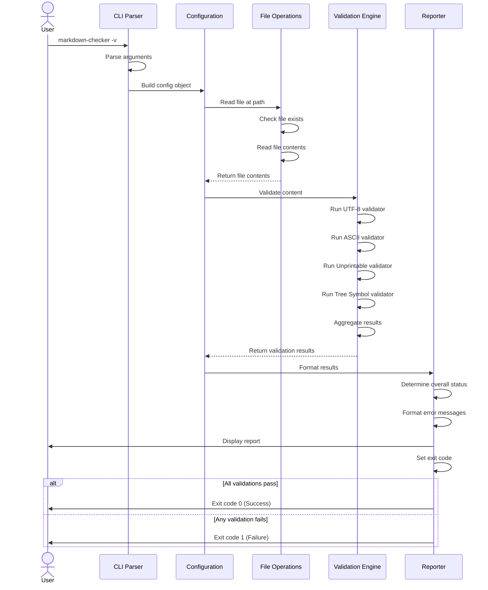
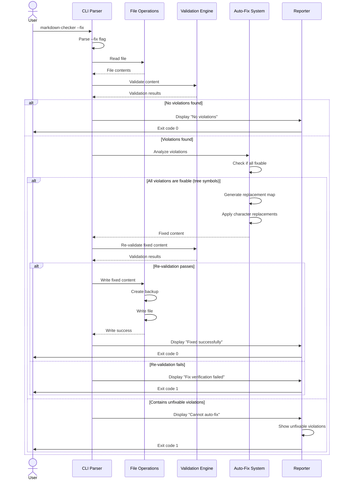
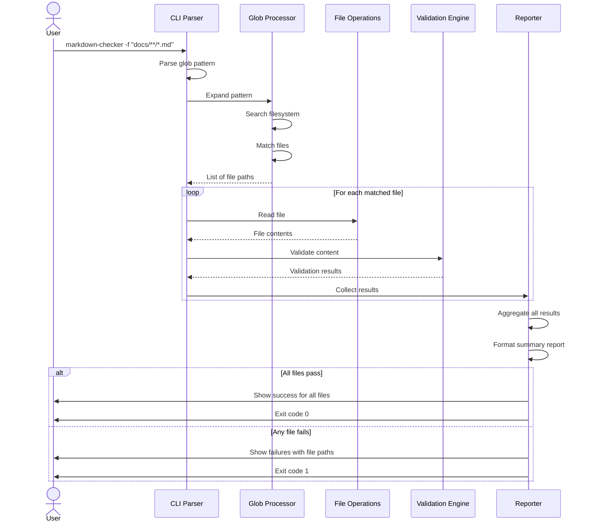
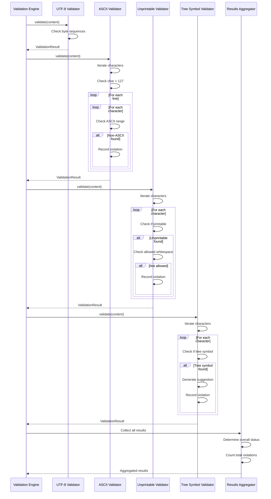
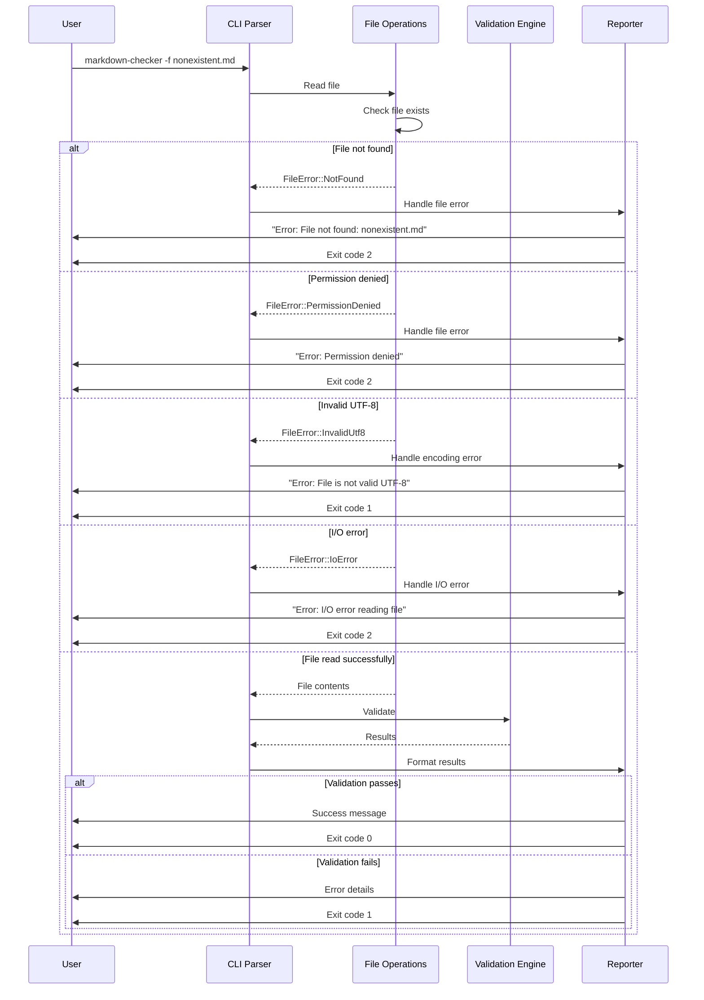
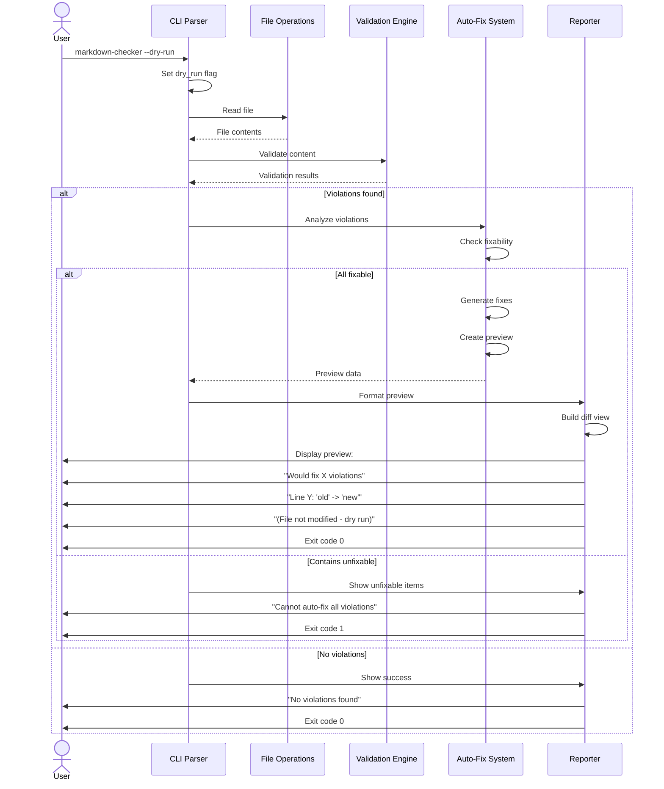
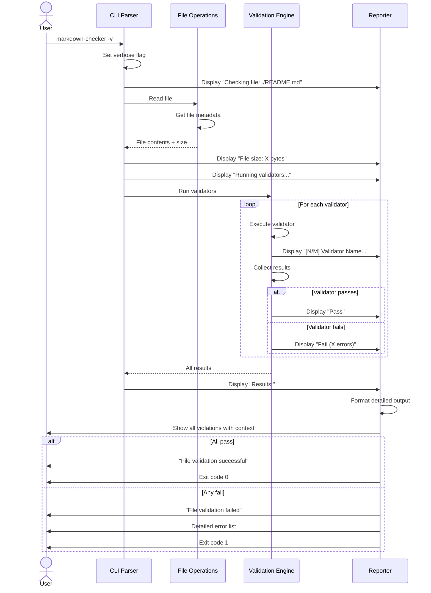
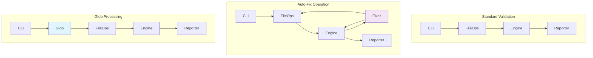

# Workflows & Sequence Diagrams

This page documents the key workflows and operational sequences in Markdown Checker.

## Table of Contents

1. [Basic Validation Workflow](#basic-validation-workflow)
2. [Auto-Fix Workflow](#auto-fix-workflow)
3. [Glob Pattern Processing](#glob-pattern-processing)
4. [Validation Engine Sequence](#validation-engine-sequence)
5. [Error Handling Flow](#error-handling-flow)
6. [Dry-Run Mode Workflow](#dry-run-mode-workflow)

---

## Basic Validation Workflow

This sequence shows a standard file validation without fix mode:

---

## Auto-Fix Workflow

This sequence shows the auto-fix operation with validation:

---

## Glob Pattern Processing

This sequence shows how multiple files are processed with glob patterns:

---

## Validation Engine Sequence

This detailed sequence shows how validators are executed:

---

## Error Handling Flow

This sequence shows how different error types are handled:

---

## Dry-Run Mode Workflow

This sequence shows the preview-only mode for fixes:

---

## Verbose Mode Output Sequence

This sequence shows enhanced output in verbose mode:

---

## Component Interaction Matrix

This diagram shows which components interact during different operations:

---

## Related Documentation

- [Architecture Overview](Architecture.md) - System architecture diagrams
- [Key Components](Components.md) - Component details
- [Validation Engine](Validation-Engine.md) - Validator implementation details
- [Auto-Fix System](Auto-Fix-System.md) - Fix mechanism details
- [CLI Interface](CLI-Interface.md) - Command-line interface details
